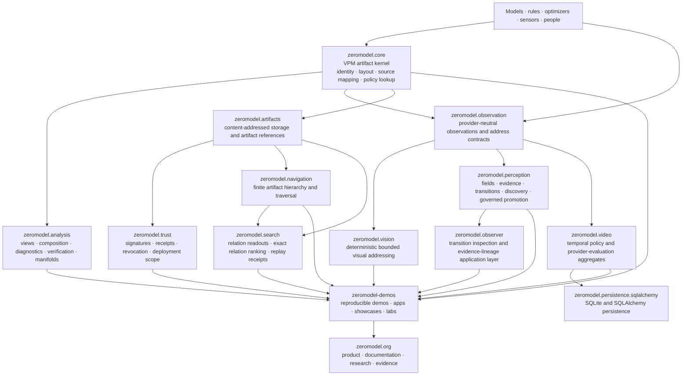

# ZeroModel 1.2.0

## The foundation for Visual AI Computing

**ZeroModel turns scored state, visual evidence, and bounded decision logic into deterministic, inspectable, identity-bearing computational artifacts.**

Models, rules, optimizers, sensors, and people can produce intelligence. ZeroModel gives the resulting evidence and decisions a durable form: Visual Policy Maps, observation records, transition contracts, verification reports, provenance chains, trust receipts, and small deterministic consumers.

> **ZeroModel 1.2.0 establishes the foundation for Visual AI Computing: a coordinated artifact system in which bounded visual evidence and policy can be compiled, addressed, compared, verified, persisted, trusted, navigated, and consumed without hiding the result inside the process that created it.**

This is a deliberately bounded claim. ZeroModel does **not** currently claim general open-world visual intelligence, arbitrary image understanding, universal causal diagnosis, or safe autonomous deployment. The authoritative evidence boundary is maintained in [`docs/claims-audit.md`](docs/claims-audit.md).

- Website: [zeromodel.org](https://zeromodel.org/)
- Demonstrations: [ernanhughes/zeromodel-demos](https://github.com/ernanhughes/zeromodel-demos)
- Claims and evidence: [`docs/claims-audit.md`](docs/claims-audit.md)
- Release posture: [`docs/releases/1.2.0.md`](docs/releases/1.2.0.md)

---

## What Visual AI Computing means

Most AI systems produce an answer and leave the evidence, alternatives, policy state, representation choices, and operational consequences scattered across model calls, logs, databases, and application code.

ZeroModel treats those structures as first-class computational artifacts:

```text
observation, scores, rules, model output, or expert policy
                         ↓
              explicit representation contract
                         ↓
         deterministic identity-bearing artifact
                         ↓
       inspect · compare · verify · persist · trust
                         ↓
        small runtime, application, person, or model
```

A Visual Policy Map is the core artifact: a deterministic spatial view over scored rows and metrics with stable identifiers, a declared layout recipe, source mapping, provenance, and content identity. The wider ZeroModel package system builds observation, perception, policy, persistence, trust, navigation, and operational contracts around that kernel.

The architectural shift is:

> **Do not repeatedly reconstruct stable intelligence when it can be compiled into an identified artifact and read as a sign.**

The intelligence required to create the artifact remains upstream. ZeroModel makes its result inspectable, portable, testable, and governable.

---

## System architecture



The machine-readable package authority is [`package-boundaries.toml`](package-boundaries.toml). Core has no ZeroModel package dependency; higher-level packages consume explicitly declared lower-level contracts.

---

## Evidence before advertising

ZeroModel uses a five-state evidence ladder. The qualifier attached to a result—such as *within the committed fixture* or *at the tested operating point*—is part of the status.

| Status | Meaning |
|---|---|
| **Not implemented** | The repository does not contain the claimed mechanism. |
| **Implemented / unmeasured** | Code exists, but no committed benchmark or evidence package measures the claimed capability. |
| **Measured / unsupported** | A measurement exists, but it does not support the stronger public claim or a useful operating region has not been identified. |
| **Measured / refuted within stated conditions** | A declared experiment produced evidence against the claim under its recorded conditions. |
| **Validated within bounded conditions** | The mechanism is implemented and covered by explicit tests or reproducible evidence for a precisely bounded claim. |

Negative results are retained. An approach that fails under a pinned fixture, calibration, provider, or representation remains useful evidence and must not be silently converted into a success claim.

Read the complete matrix in [`docs/claims-audit.md`](docs/claims-audit.md).

---

## Capability, proof, demonstration, and boundary

The core repository is the source of truth for implementation and evidence. The demos repository explains and presents the work, but must not strengthen a claim beyond the evidence recorded here.

| Major capability | Current bounded result | Proof | Demonstration | Boundary |
|---|---|---|---|---|
| **VPM artifact kernel** | Deterministic artifacts preserve scored values, stable row/metric IDs, layout, source mapping, provenance, and identity. | [`packages/core/README.md`](packages/core/README.md) · [`docs/claims-audit.md`](docs/claims-audit.md) | [Visual Policy Map Lookup programme](https://github.com/ernanhughes/zeromodel-demos/blob/main/catalog.yaml) | Identity and mapping do not prove semantic correctness or authorship. |
| **Dense multi-view analysis** | One scored source can produce multiple deterministic policy views while preserving source identity and mappings. | [`docs/examples/view-profiles.md`](docs/examples/view-profiles.md) · [`docs/research/dense-multiview-representation.md`](docs/research/dense-multiview-representation.md) | [Policy Profiles](https://github.com/ernanhughes/zeromodel-demos) | No current human-study evidence proves faster or better inspection. |
| **Compiled policy lookup** | A finite policy can be compiled into a VPM and read by stable state address without a model call during lookup. | [`docs/examples/sign-reader.md`](docs/examples/sign-reader.md) | [State Chooses the Pixel](https://github.com/ernanhughes/zeromodel-demos) | Closed enumerable states only; no unseen-state generalization. |
| **Finite policy verification** | Named row-level properties can be checked exhaustively and materialized as linked verification artifacts with exact counterexamples. | [`docs/examples/criticality-verification.md`](docs/examples/criticality-verification.md) · [`docs/research/viper-policy-compilation.md`](docs/research/viper-policy-compilation.md) | [Test the Transition](https://github.com/ernanhughes/zeromodel-demos) | Not temporal, continuous-state, or universal formal verification. |
| **Provider-neutral observation contracts** | Observations, provider identity, calibration, replay semantics, acceptance, and rejection evidence share a governed seam independent of policy identity. | [`packages/observation/README.md`](packages/observation/README.md) | [Provenance and Replay](https://github.com/ernanhughes/zeromodel-demos) | The contract governs evidence; it does not validate provider accuracy. |
| **Deterministic visual addressing** | The committed bounded arcade codebook recovers all canonical feature codewords, rows, and actions, including all 2,401 four-target waves. | [`docs/research/visual-sign-reader.md`](docs/research/visual-sign-reader.md) · [`packages/vision/README.md`](packages/vision/README.md) | [Visual Policy Map Lookup programme](https://github.com/ernanhughes/zeromodel-demos/blob/main/catalog.yaml) | Exact closed-world addressing, not general computer vision or accepted non-exact recognition. |
| **Visual transition evidence** | In the deterministic arcade benchmark, declared fields and contracts improve visible changed-component attribution over the committed raw-pixel baseline. | [`examples/visual_transition_benchmark/`](examples/visual_transition_benchmark/) · [`docs/claims-audit.md`](docs/claims-audit.md) | [Transition Inspector](https://github.com/ernanhughes/zeromodel-demos/tree/main/apps/transition-inspector) | Visible component attribution is not perfect fault attribution or causal diagnosis. |
| **Value and relation contracts** | Typed values and selected relations detect bounded wrong-direction, wrong-magnitude, and wrong-value faults that component-presence evidence cannot express. | [`docs/research/value-aware-transition-contracts.md`](docs/research/value-aware-transition-contracts.md) | [Numeric State Contract and Relation Contract programme](https://github.com/ernanhughes/zeromodel-demos/blob/main/catalog.yaml) | Hidden target identity and visually absent events remain unresolved. |
| **Cross-domain contract replication** | Component attribution and one relation contract replicated across independently rendered arcade and warehouse domains under the frozen benchmark. | [`docs/research/cross-domain-visual-contract-replication.md`](docs/research/cross-domain-visual-contract-replication.md) | [Cross-Domain Contract Replication](https://github.com/ernanhughes/zeromodel-demos/blob/main/catalog.yaml) | Two small deterministic domains do not establish open-world generalization. |
| **Evidence Contract Compiler** | A bounded deterministic search compiled an evidence-preserving representation for 11 of 12 declared requirements and identified one insufficient-observability case. | [`docs/research/evidence-contract-representation-compiler.md`](docs/research/evidence-contract-representation-compiler.md) | [Evidence Contract Compiler](https://github.com/ernanhughes/zeromodel-demos/blob/main/catalog.yaml) | Requirements remain human-declared; the compiler searches a fixed bounded candidate family. |
| **Temporal policy and provider evaluation** | Immutable provider-evaluation aggregates distinguish exact-state, action-equivalent, action-changing, and rejected outcomes while binding provider, observation, policy, and evidence identities. | [`docs/architecture/provider-evaluation-rmdto.md`](docs/architecture/provider-evaluation-rmdto.md) · [`packages/video/README.md`](packages/video/README.md) | [Observe the Consequence](https://github.com/ernanhughes/zeromodel-demos) | Evidence accounting does not prove provider quality or calibrated confidence. |
| **SQLite persistence** | DTO-only video and observation aggregates persist through explicit SQLAlchemy/SQLite stores with reload, parity, rollback, and tamper checks. | [`packages/sqlalchemy/README.md`](packages/sqlalchemy/README.md) | [Durable Activation Across Restart programme](https://github.com/ernanhughes/zeromodel-demos/blob/main/catalog.yaml) | Reference persistence is not distributed coordination or production availability. |
| **Perception promotion and rollback** | The bounded reference path records candidate validation, review, materialization, activation, durable receipts, exact inverse plans, and rollback across SQLite restart. | [`packages/perception/README.md`](packages/perception/README.md) · [`packages/perception/docs/p18h-durable-activation-and-rollback.md`](packages/perception/docs/p18h-durable-activation-and-rollback.md) | [Governed Exact-State Rollback programme](https://github.com/ernanhughes/zeromodel-demos/blob/main/catalog.yaml) | Rollback restores stored state; it does not prove semantic safety or enterprise authorization. |
| **Artifact storage and identity** | Canonical references and content-addressed storage preserve artifact identity independently of presentation. | [`packages/artifacts/README.md`](packages/artifacts/README.md) | [Provenance and Replay](https://github.com/ernanhughes/zeromodel-demos) | Content identity is not authenticity or approval. |
| **Trust contracts** | Signature envelopes, trust receipts, revocation, and deployment-scope contracts can bind decisions to identified artifacts. | [`packages/trust/README.md`](packages/trust/README.md) | [Provenance and Replay](https://github.com/ernanhughes/zeromodel-demos) | Trust DTOs and signatures do not constitute organizational authorization by themselves. |
| **Finite artifact navigation** | Identified artifact corpora can be compiled into deterministic finite hierarchies and traversed. | [`packages/navigation/README.md`](packages/navigation/README.md) | [Representation and provenance labs](https://github.com/ernanhughes/zeromodel-demos) | Search, planet-scale traversal, and constant-time navigation are not validated claims. |
| **Relation-aware Search** | Declared relation-specific readouts over frozen representations can rank identified candidates deterministically within synthetic fixtures, materialize a VPM, and replay a receipt. | [`packages/search/README.md`](packages/search/README.md) | Not yet promoted to a public demo | Does not generate embeddings, discover relations, guarantee improvement over cosine, or validate scalable candidate filtering. |
| **Observer application layer** | Transition inspection can combine policy expectation, visual evidence, representation boundaries, contract results, and provenance metadata. | [`packages/observer/README.md`](packages/observer/README.md) | [Transition Inspector](https://github.com/ernanhughes/zeromodel-demos/tree/main/apps/transition-inspector) | The browser reconstruction is not yet the production compiler, ledger, or replay runtime. |

---

## Package system

ZeroModel 1.2.0 is coordinated across twelve namespace-package distributions:

| Distribution | Import namespace | Purpose |
|---|---|---|
| `zeromodel` | `zeromodel.core` | Immutable artifact kernel, views, rendering, bounded policy lookup, Lua export. |
| `zeromodel-analysis` | `zeromodel.analysis` | Composition, diagnostics, verification, optimization, patterns, manifolds, learning and training artifacts. |
| `zeromodel-observation` | `zeromodel.observation` | Observation identity and provider-neutral visual-address contracts. |
| `zeromodel-vision` | `zeromodel.vision` | Deterministic closed-world visual indexing and policy addressing. |
| `zeromodel-perception` | `zeromodel.perception` | Fields, evidence, conformance, transition discovery, validation, promotion, activation, and rollback. |
| `zeromodel-observer` | `zeromodel.observer` | Demonstration/application layer for transition evidence and artifact lineage. |
| `zeromodel-video` | `zeromodel.video` | Temporal policy and video action-set DTO/store contracts. |
| `zeromodel-sqlalchemy` | `zeromodel.persistence.sqlalchemy` | Explicit SQLAlchemy and SQLite persistence. |
| `zeromodel-artifacts` | `zeromodel.artifacts` | Artifact references, resolution, and content-addressed storage. |
| `zeromodel-trust` | `zeromodel.trust` | Authenticity, trust receipts, revocation, and deployment scope. |
| `zeromodel-navigation` | `zeromodel.navigation` | Finite artifact hierarchy compilation and traversal. |
| `zeromodel-search` | `zeromodel.search` | Deterministic relation-aware exact search over identified frozen representations. |

The legacy root compatibility surface that re-exported every capability from `zeromodel/__init__.py` has been removed. Import from the owning package namespace directly.

---

## Install from a local clone

The coordinated 1.2.0 packages are not assumed to be available from a package index until the release process records publication.

```bash
git clone https://github.com/ernanhughes/zeromodel.git
cd zeromodel
python scripts/bootstrap_dev_environment.py
```

`scripts/bootstrap_dev_environment.py` upgrades `pip`, installs
`requirements-dev.txt`, verifies the critical test imports, and prints the
installed ZeroModel package paths and versions. `requirements-dev.txt` remains
the single development-dependency authority: it installs all twelve packages in
editable mode plus the test, rendering, cryptography, build, lint, and typing
toolchain.

For a non-editable local installation:

```bash
python -m pip install \
  ./packages/core \
  ./packages/analysis \
  ./packages/observation \
  ./packages/vision \
  ./packages/perception \
  ./packages/observer \
  ./packages/video \
  ./packages/sqlalchemy \
  ./packages/artifacts \
  ./packages/trust \
  ./packages/navigation \
  ./packages/search
```

Verify the checkout:

```bash
python scripts/run_fast_tests.py
```

For a fresh environment, bootstrap and verify in one command:

```bash
python scripts/bootstrap_dev_environment.py --run-fast-tests
```

Run the heavier coordinated release gate only when preparing a release candidate:

```bash
python scripts/validate_release_candidate.py
```

See [`docs/release.md`](docs/release.md).

---

## Minimal artifact example

```python
from zeromodel.core import LayoutRecipe, ScoreTable, build_vpm

source = ScoreTable(
    values=[[0.90, 0.20], [0.40, 0.80]],
    row_ids=["candidate-a", "candidate-b"],
    metric_ids=["quality", "uncertainty"],
)

recipe = LayoutRecipe.from_dict(
    {
        "version": "vpm-layout/0",
        "name": "quality-first",
        "row_order": {
            "kind": "lexicographic",
            "keys": [{"metric_id": "quality", "direction": "desc"}],
            "tie_break": "row_id",
        },
        "column_order": {"kind": "source"},
        "normalization": {"kind": "per_metric_minmax", "clip": True},
    }
)

artifact = build_vpm(source, recipe)
cell = artifact.cell(view_row=0, view_column=0)

print(artifact.artifact_id)
print(cell.row_id, cell.metric_id, cell.raw_value)
```

A policy artifact can then be read as a bounded sign:

```python
from zeromodel.core import VPMPolicyLookup

reader = VPMPolicyLookup(artifact, action_metric_ids=("quality", "uncertainty"))
decision = reader.read("candidate-a")

print(decision.action, decision.value, decision.artifact_id)
```

---

## The coordinated project

| Repository | Responsibility |
|---|---|
| [`ernanhughes/zeromodel`](https://github.com/ernanhughes/zeromodel) | Implementation, packages, tests, benchmarks, evidence, claim boundaries, and releases. |
| [`ernanhughes/zeromodel-demos`](https://github.com/ernanhughes/zeromodel-demos) | Reproducible demonstrations, browser applications, showcases, labs, and bounded experiments. |
| [`ernanhughes/zeromodel.org`](https://github.com/ernanhughes/zeromodel.org) | Hugo source for the public product, documentation, research, release, and business website. |
| [`ernanhughes/zeromodel.github.io`](https://github.com/ernanhughes/zeromodel.github.io) | Public static deployment target. |

The flow is:

```text
core implementation and evidence
            ↓
reproducible demonstrations
            ↓
interactive public explanation
            ↓
commercial platform and applications
```

Claims may be simplified as they move outward, but they must never be silently strengthened.

---

## Current boundary

ZeroModel has validated substantial foundations for Visual AI Computing. It has not yet validated general Visual AI.

The central open problem is trustworthy observation-to-evidence compilation in less constrained environments. Current work must continue to distinguish:

- evidence that exists but is lost by the representation;
- evidence that can be recovered by a bounded representation compiler;
- evidence that was never present in the permitted observation;
- state errors that preserve the same policy action;
- action-changing errors;
- provider confidence from independently calibrated evidence;
- artifact identity from authenticity and authorization.

That boundary is a design requirement, not a disclaimer added after the result.

Read [`docs/claims-audit.md`](docs/claims-audit.md) before making public capability claims.

---

## License

MIT. See [`LICENSE`](LICENSE).
