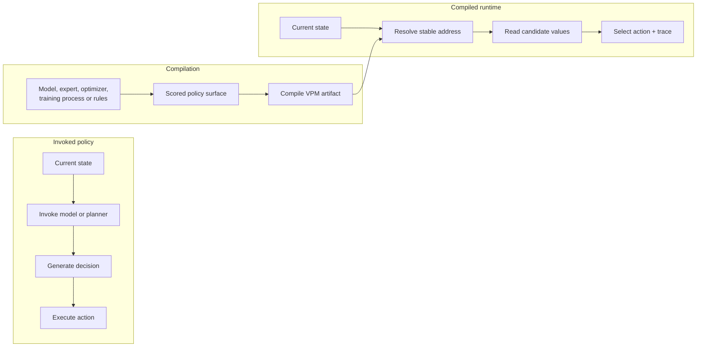
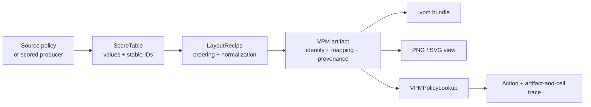
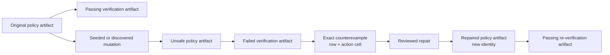
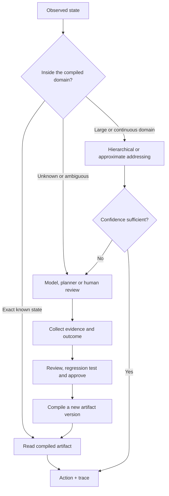

+++
date = '2026-07-16T18:43:53+01:00'
draft = true
title = 'Signs, Not Directions: Compiling AI Policy into Visual Artifacts'
thumbnail='/img/zero.png'
categories = ["ZeroModel", "AI"]

tags = ["ZeroModel", "AI Debugging", "VPM", "Visual Policy Maps", "Edge AI", "Explainable AI", "AI Compression", "AI Provenance", "Hierarchical Memory", "Spatial Intelligence", "Symbolic AI"]
+++

*What happens when a system stops asking an AI for the same directions repeatedly, and starts placing signs where decisions need to be made?*

---

## ZeroModel in One Image

Most AI systems repeatedly invoke a policy: observe the current state, ask a model what to do, execute the answer, and ask again at the next decision.

ZeroModel explores a different architecture. When a policy is bounded and stable, it can be compiled into a deterministic artifact that the runtime addresses directly.

Here is the sign. Here is the game reading it. And here is the cell-level trace behind every decision it makes. [C1](#claim-c1) [C2](#claim-c2) [C3](#claim-c3)


This is not a conceptual animation or a mock-up of a future system. It is the complete replay of a tiny arcade shooter driven by one compiled Visual Policy Map.

The world is deliberately small and enumerable:

* 112 possible states
* 4 possible actions
* 448 state-action values
* 22 decisions in the episode shown above
* 4 targets cleared
* 0 model calls during policy lookup

At every step, the same process occurs:

```text
current game state
        ↓
state address
        ↓
row in the VPM
        ↓
winning action cell
        ↓
LEFT / RIGHT / STAY / FIRE
        +
artifact and source trace
```

The runtime is not asking a model what to do on every frame.

The policy has already been compiled into an artifact. The runtime only has to identify the current state, locate the corresponding row, compare the candidate action values, and execute the winning action.

### What the Figure Shows

The animation is divided into four connected views.

#### 1. The Current State

The left panel shows the game state required by the policy:

* the player’s current column;
* the current target column;
* the firing cooldown.

Together, these values form a stable row address:

```text
tank=0|target=0|cooldown=0
```

That string contains the complete policy state and functions as an artifact address rather than a prompt.

#### 2. The Addressed VPM Row

The centre panel shows the complete Visual Policy Map.

Each row represents one of the 112 possible game states. The four columns represent the candidate actions:

```text
LEFT
RIGHT
STAY
FIRE
```

As the game changes, the horizontal marker moves to the row associated with the current state. The vertical marker identifies the action cell selected from that row.

The brightness of the field is normalized independently within each action column. In this demo, the raw action values already span the range from `0.0` to `1.0`, so the normalized view preserves those values directly.

#### 3. The Winning Action

The selected row contains one value for each candidate action.

When the tank is aligned with the target and the firing cooldown is zero, the row contains:

```text
LEFT   0.0
RIGHT  0.0
STAY   0.0
FIRE   1.0
```

`VPMPolicyLookup` performs a deterministic argmax over those values.

The result is:

```text
FIRE
```

There is no model invocation, planning step, prompt generation, or newly generated chain of instructions at this point.

The decision already exists inside the compiled artifact.

#### 4. The Action Trace

The right panel shows that ZeroModel returns more than the selected action.

Each decision includes:

```text
artifact ID
state row ID
selected action
selected value
all candidate values
source row index
source metric index
view row
view column
```

The runtime can therefore report not only:

> The selected action was `FIRE`.

It can also report:

> The action was `FIRE` because this state addressed this row, where the `FIRE` cell contained the winning value, inside this specific policy artifact.

This is a trace to the exact compiled source of the decision. It does not explain why the original policy generator assigned that value, but it does identify which artifact cell supplied the runtime action. [C3]

That is the smallest working expression of the ZeroModel idea:

> **Compile the information once. Give it an identity. Make it addressable. Let small consumers read it repeatedly.**

The rest of this article explains how the artifact is constructed, how `VPMPolicyLookup` reads it, and why the larger architectural idea is about **signs, not directions**.

### Reproduce the Figure

The figure and replay are generated from the same public API and runtime path described in this article.

Run the renderer from the repository root:

```bash
python -m pip install matplotlib pillow

python examples/render_signs_demo.py \
  --output-dir docs/assets/signs-demo
```

The script generates:

```text
zero_policy.vpm
zero_policy_results.json
zero_policy_vpm.png
zero_money_shot.png
zero_replay.gif
```

The canonical reproducibility targets are the `.vpm` artifact identity and the JSON decision trace. Raster output may vary slightly across operating systems, fonts, Pillow versions, and Matplotlib versions.

[View the reproducible rendering script on GitHub](https://github.com/ernanhughes/zeromodel/blob/main/examples/render_signs_demo.py)

---

## ZeroModel in One Sentence

ZeroModel turns scored information into deterministic, addressable, provenance-carrying **Visual Policy Map artifacts** that different consumers can inspect, render, query, compare and replay. [C1](#claim-c1) [C5](#claim-c5) [C7](#claim-c7)

A VPM is not merely a picture.

It is a structured artifact containing:

* a source matrix;
* stable row and metric identifiers;
* an explicit layout recipe;
* deterministic row and column ordering;
* normalized view values;
* source-coordinate mapping;
* provenance and parent relationships;
* a deterministic artifact identity.

The rendered PNG or SVG is a human-readable view of that structure. The VPM itself is the machine-readable, serializable and auditable object. [C10](#claim-c10) [C11](#claim-c11) [C12](#claim-c12)

`VPMPolicyLookup` is one consumer of that artifact, not the whole of ZeroModel.

The wider package already contains primitives for:

* deterministic views over shared scored data;
* field composition and comparison;
* PNG and SVG rendering;
* identity-preserving `.vpm` bundles;
* spatial optimization;
* temporal decision manifolds;
* Q-policy criticality and decision-margin evidence;
* exhaustive finite-policy property checking;
* linked verification and counterexample artifacts;
* training-progress artifacts;
* learning and critic evidence maps;
* small deterministic runtime controllers.

These systems all operate around the same underlying idea: scored information is compiled into an identity-bearing artifact, and different consumers use that artifact for different purposes.

`VPMPolicyLookup` joins that architecture rather than redefining it.

The arcade demo therefore establishes one narrow but important result:

> A closed, enumerable policy can be materialized as a deterministic VPM and consumed without invoking a model for each runtime decision. [C1](#claim-c1) [C2](#claim-c2) [C4](#claim-c4) [C9](#claim-c9)

That is the entry point rather than the boundary of the project.

---

## The Real Distinction: Compiled Versus Invoked

I first described ZeroModel in terms of dense and sparse representations:

> **Dense policy surface. Sparse runtime path.**

That remains useful. The arcade artifact contains the complete declared state-action surface, while a runtime decision touches one row and one winning cell. But *dense* and *sparse* already carry too many meanings across AI: parameters, activations, retrieval, attention, embeddings and Mixture-of-Experts routing.

The more useful distinction is architectural:

> **Compiled versus invoked.**



Most AI agents invoke a policy repeatedly: observe, call a model, generate a decision, act, then repeat. ZeroModel asks whether a policy that has become bounded, stable and frequently reused should remain trapped behind that invocation loop.

The intelligence required to create the policy has not disappeared. A model, expert, optimizer, training process or conventional program still produces the scored information. The change is temporal: policy construction happens upstream, and runtime consumes the materialized result.

With an invoked policy, the system reconstructs the decision process when the state arrives. With a compiled policy, runtime performs addressing, candidate retrieval, deterministic selection and trace recovery. [C2](#claim-c2) [C4](#claim-c4)

This architecture is unsuitable for genuinely novel or continuously changing situations. Those still require active inference. The narrower proposal is that stable, bounded decisions should not be regenerated indefinitely merely because no durable policy object exists. [C53](#claim-c53)

The likely system is hybrid: models handle discovery and adaptation; artifacts handle the reviewed common path. That is the larger meaning of **signs, not directions**. [C54](#claim-c54)

---

## Signs, Not Directions

Imagine two travellers approaching a difficult road network.

The first receives a large map containing every road, junction, warning and alternative route. At every turn, she stops, unfolds it and reconstructs what to do next.

The second encounters a sign:

> **TURN LEFT**

The sign is not more intelligent than the map.

It is information prepared for a particular decision at a particular location.

The reasoning required to determine the route happened earlier. Part of its result has been materialized in the environment, where it can be read quickly and repeatedly.

That is the simplest mental model for `VPMPolicyLookup`.

```text
COMPILE TIME

model, expert, optimizer,
training process or rules
          ↓
scored state-action table
          ↓
      VPM artifact
```

```text
RUNTIME

current state
      ↓
stable row address
      ↓
VPMPolicyLookup
      ↓
compare candidate values
      ↓
LEFT / RIGHT / STAY / FIRE
      +
artifact-and-cell trace
```

The reader neither invents the policy nor plans a route; it resolves a declared state and reads the prepared values.

The runtime encounters a declared state, resolves its row, compares the candidate action values and reads the sign. [C2](#claim-c2) [C4](#claim-c4)

This distinction matters because the sign is not merely a cached answer.

It belongs to an identity-bearing artifact that preserves the complete policy surface, the alternative actions, the source coordinates and the provenance required to inspect or replay the decision. [C3](#claim-c3) [C7](#claim-c7) [C9](#claim-c9)

The shipped documentation therefore describes `VPMPolicyLookup` as a deterministic reader, not as a model, agent or planner.

That is the architectural pattern ZeroModel is proposing:

> **Use models to discover and construct policies. Use artifacts to carry stable decisions into the places where they will be repeatedly needed.** [C54](#claim-c54)

---

## The Boundary of the Experiment

Before building the demo, its boundary needs to be explicit.

This is **not**:

* a claim that dense representations universally outperform sparse ones;
* a demonstration of open-world intelligence;
* evidence of generalization to states that were never compiled;
* a replacement for learned policies in continuous or rapidly changing environments;
* a claim that the rendered PNG or GIF independently executes the policy;
* a latency or memory benchmark on constrained hardware;
* validation of ZeroModel’s spatial optimizer, hierarchical addressing, or decision-manifold research.

This **is**:

* a controlled experiment in policy compilation;
* a complete, finite state-action surface;
* a decision-time path requiring no model call;
* a deterministic, identity-bearing artifact;
* a visual and machine-readable representation of the policy;
* an exact artifact, cell, and source trace for every selected action;
* a foundation for deterministic replay. [C1](#claim-c1) [C3](#claim-c3) [C4](#claim-c4) [C5](#claim-c5) [C7](#claim-c7) [C9](#claim-c9) [C10](#claim-c10)

The environment is intentionally small because a small environment can be inspected and tested exhaustively.

Every declared state can be enumerated. Every candidate action can be examined. Every runtime decision can be traced back to the artifact cell that produced it.

This is a deliberately closed experiment in which **correctness can be defined, inspected and measured exactly**, not a miniature stand-in for an open world.

---

> **No capability should borrow validation from a fixture that did not measure it.**

---

## The Hydrogen Atom: A Tiny Arcade Shooter

The ZeroModel example is a deterministic, headless, Space-Invaders-style arcade shooter.

It is deliberately minimal.

```python
from dataclasses import dataclass


@dataclass(frozen=True)
class ShooterConfig:
    width: int = 7
    wave: tuple[int, ...] = (0, 6, 1, 5)
    max_steps: int = 32
```

The player controls a tank that moves across seven screen columns.

Targets appear one at a time. The tank must move into the current target’s column, obey a one-step firing cooldown, and clear the four-target wave before reaching the step limit.

The environment exposes only the state required by the policy:

```text
tank_x
target_x
cooldown
```

The available actions are:

```python
ACTIONS = ("LEFT", "RIGHT", "STAY", "FIRE")
```

There are no hidden observations, latent state variables, or undeclared actions in this experiment.

### The Complete State Surface

The policy contains:

```text
7 possible tank positions
×
8 possible target states
  - no current target
  - or one of 7 target columns
×
2 cooldown states
=
112 declared states
```

Each state contains one value for each of the four candidate actions:

```text
112 states × 4 actions = 448 state-action cells
```

The entire declared policy surface can therefore be enumerated and inspected.

That matters for three reasons.

### 1. Exhaustive Validation Is Possible

Every one of the 112 states can be generated deliberately.

For each state, we can compare the source policy’s expected action values with the values stored in the compiled artifact.

Validation does not have to depend on a sampled test set.

### 2. Behaviour Is Controlled

The complete state representation, action set, transition rules, cooldown behaviour, target order and stopping conditions are known.

There are no unseen-state assumptions or approximation boundaries hidden inside the demonstration.

### 3. The Claim Is Falsifiable

The compiled artifact must preserve the source values and selections across all 112 states. That makes the shooter the **hydrogen atom of visual policy compilation**:

> **Simple enough to solve completely. Complex enough to expose the mechanism.**

The purpose of the example is not to simulate the complexity of an open world.

It is to isolate policy compilation in an environment where the artifact, the runtime and the resulting behaviour can all be checked precisely. [C1](#claim-c1)

---

## Step One: Give Every State an Address

The runtime needs a deterministic way to locate the policy row corresponding to the current game state.

In this example, each state receives a stable, human-readable row identifier:

```python
def state_row_id(
    tank_x: int,
    target_x: int | None,
    cooldown: int,
) -> str:
    target = "none" if target_x is None else str(int(target_x))

    return (
        f"tank={int(tank_x)}"
        f"|target={target}"
        f"|cooldown={int(cooldown)}"
    )
```

Example addresses include:

```text
tank=3|target=0|cooldown=0
tank=3|target=3|cooldown=1
tank=6|target=none|cooldown=0
```

This is a deterministic address into the declared policy surface, not a natural-language prompt.

At runtime, the environment exposes its current address through:

```python
row_id = game.row_id()
```

`VPMPolicyLookup` uses that identifier to locate the corresponding artifact row.

```text
game state
    ↓
stable row_id
    ↓
artifact row
```

The row identifier is therefore the bridge between the live environment and the compiled policy.

The string format is deliberately readable for the demo, but ZeroModel does not require state addresses to look like prose. Another system could use canonical integers, tuples, hashes, or domain-specific identifiers, provided that the mapping is stable and unambiguous.

What matters is the contract:

> **The same declared state must resolve to the same policy row.** [C7](#claim-c7)

---

## Step Two: Define the Source Policy

The demo uses a handcrafted deterministic policy.

For every declared game state, the source policy produces one value for each possible action:

```python
def _action_values(
    tank_x: int,
    target_x: int | None,
    cooldown: int,
) -> tuple[float, ...]:
    if target_x is None:
        return (0.0, 0.0, 1.0, 0.0)

    if cooldown == 0 and tank_x == target_x:
        return (0.0, 0.0, 0.0, 1.0)

    if tank_x > target_x:
        return (1.0, 0.0, 0.1, 0.0)

    if tank_x < target_x:
        return (0.0, 1.0, 0.1, 0.0)

    return (0.0, 0.0, 1.0, 0.0)
```

The values always follow the declared action order:

```python
ACTIONS = ("LEFT", "RIGHT", "STAY", "FIRE")
```

Consider this state:

```text
tank=3|target=0|cooldown=0
```

The tank is to the right of the target, so the policy assigns:

```text
LEFT   = 1.0
RIGHT  = 0.0
STAY   = 0.1
FIRE   = 0.0
```

The winning action is:

```text
LEFT
```

Now consider an aligned target with no firing cooldown:

```text
tank=3|target=3|cooldown=0
```

The values become:

```text
LEFT   = 0.0
RIGHT  = 0.0
STAY   = 0.0
FIRE   = 1.0
```

The winning action is:

```text
FIRE
```

The important point is that the policy preserves more than the final action.

Each state retains:

* the winning action;
* every alternative action;
* the value assigned to each alternative;
* the margin between the winner and the alternatives;
* any ties that must be resolved;
* the complete scored surface from which the decision is selected.

The `STAY = 0.1` value in the first example is useful. It shows that the artifact does not merely store the instruction `LEFT`. It stores the policy’s relative preference across all four available actions.

When these values are compiled into a VPM, each one also receives stable source and view coordinates. The runtime can therefore return both the chosen action and the exact artifact cell from which it was selected. [C3](#claim-c3) [C7](#claim-c7)

### An Honest Boundary

ZeroModel does not learn the shooter policy; the values are handcrafted and then compiled.

In another system, the source values might come from:

* a trained neural policy;
* reinforcement learning;
* a planner;
* a human-authored rule system;
* historical decisions;
* an optimization process;
* an ensemble of models.

ZeroModel is agnostic about how those values were produced. Its role begins once the policy has become **scored, structured information**:

1. materialize that information as a deterministic artifact;
2. preserve the complete declared action surface;
3. give the artifact a stable identity;
4. allow a small runtime consumer to address and use it repeatedly. [C1](#claim-c1) [C2](#claim-c2)

The intelligence remains upstream; ZeroModel makes its result persistent, inspectable and machine-consumable.

---

## Step Three: Construct the `ScoreTable`

The complete declared policy is now enumerated.

```python
row_ids: list[str] = []
values: list[tuple[float, ...]] = []

targets: tuple[int | None, ...] = (
    None,
    *range(config.width),
)

for tank_x in range(config.width):
    for target_x in targets:
        for cooldown in (0, 1):
            row_ids.append(
                state_row_id(
                    tank_x,
                    target_x,
                    cooldown,
                )
            )

            values.append(
                _action_values(
                    tank_x,
                    target_x,
                    cooldown,
                )
            )
```

This loop generates one row for every declared combination of:

```text
tank position
target state
cooldown state
```

Because `None` appears first in `targets`, the enumeration order is stable and explicit:

```text
no target
target column 0
target column 1
...
target column 6
```

The result is:

```text
112 row identifiers
112 rows of action values
4 action values per row
448 total cells
```

Those rows become a standard ZeroModel `ScoreTable`:

```python
from zeromodel import ScoreTable


table = ScoreTable(
    values=values,
    row_ids=row_ids,
    metric_ids=ACTIONS,
    metadata={
        "kind": "arcade_shooter_policy",
        "world": "tiny_arcade_shooter",
        "addressing": "tank_x,target_x,cooldown",
        "slogan": "signs_not_directions",
    },
)
```

The mapping is direct:

| ZeroModel concept | Shooter meaning                 |
| ----------------- | ------------------------------- |
| Row               | One discretized game state      |
| Row ID            | Stable runtime state address    |
| Metric column     | One candidate action            |
| Cell              | Value assigned to that action   |
| Winning cell      | Action selected by the consumer |

The `ScoreTable` does not need to understand tanks, targets, cooldowns, or firing.

It only knows that it contains:

* a rectangular numeric matrix;
* stable row identifiers;
* stable metric identifiers;
* structured metadata.

The domain meaning is supplied by the producer and the consumer.

That is why ZeroModel uses the general term **metric** rather than baking actions, risks, rewards, or training measurements into the artifact kernel.

In this policy, the metrics are:

```text
LEFT
RIGHT
STAY
FIRE
```

In a critic artifact, they might be:

```text
risk
evidence_support
policy_fit
```

In a training-progress artifact, they might be:

```text
heldout_progress
regression_safety
stability
```

The underlying structure remains the same:

```text
identified rows
        ×
identified metrics
        =
scored information
```

The consumer supplies the interpretation: `VPMPolicyLookup` treats metrics as candidate actions, while another consumer might treat them as risk, evidence, training progress or routing confidence.

This domain-neutral structure is what allows ZeroModel to place different kinds of scored information inside the same artifact system. [C1](#claim-c1) [C7](#claim-c7)

At this stage we have a source table, not yet a VPM artifact. Compilation requires an explicit layout recipe.

---

## Step Four: Declare the `LayoutRecipe`

A ZeroModel artifact does not silently invent its spatial organization.

The layout is part of the artifact contract, so it must be declared explicitly.

```python
from zeromodel import LayoutRecipe


recipe = LayoutRecipe.from_dict({
    "version": "vpm-layout/0",
    "name": "arcade-shooter-policy-source-order",
    "row_order": {
        "kind": "source",
        "tie_break": "row_id",
    },
    "column_order": {
        "kind": "source",
    },
    "normalization": {
        "kind": "per_metric_minmax",
        "clip": True,
    },
})
```

This recipe declares three important decisions.

### Preserve the Source Row Order

```text
row_order = source
```

The 112 states remain in the same order in which the source policy enumerated them.

The recipe does not ask an optimizer to rearrange states according to salience, similarity, concentration, or any learned spatial relationship.

### Preserve the Action Order

```text
column_order = source
```

The metric columns remain:

```text
LEFT
RIGHT
STAY
FIRE
```

That order is shared by the source policy, the `ScoreTable`, the compiled artifact and the runtime reader.

### Normalize Each Metric Explicitly

```text
normalization = per_metric_minmax
```

Each action column is normalized according to the named recipe, with values clipped to the permitted range.

Per-metric normalization deserves care in a policy artifact. If different action columns have different minimum and maximum values, normalizing them independently could change comparisons between actions.

That does not happen in this experiment.

Each of the four action columns already has a minimum of `0.0` and a maximum of `1.0`, so normalization preserves the source values and therefore preserves the winning action in every row.

Source ordering is intentional here. The demo avoids claims about optimizer quality, top-left concentration or emergent manifolds in favour of a deliberately boring, reproducible contract:

```text
source states remain in declared order
actions remain LEFT, RIGHT, STAY, FIRE
normalization follows a named recipe
```

That makes policy fidelity easier to inspect, test and reproduce.

The important principle is:

> **A VPM’s spatial arrangement is declared data, not an undocumented rendering side effect.** [C8](#claim-c8)

The recipe becomes part of the artifact’s canonical contents. Changing its ordering or normalization produces a different artifact identity. [C5](#claim-c5) [C6](#claim-c6)

### The Contract Beneath the Demo

Deterministic policy artifacts require unambiguous identity and normalization. ZeroModel encodes numeric matrices with canonical IEEE-754 big-endian bytes, validates metadata and provenance scalars, preserves constant-value columns rather than collapsing them during min-max normalization, and pins the identity contract with a golden artifact test.

These details prevent incidental Python or JSON representations from determining identity and prevent uniformly high constant signals from disappearing in the rendered field. They are infrastructure rather than the headline, but the public policy demo depends on them.

At the end of this step, ZeroModel has a scored source table and an explicit layout contract. It can now build the VPM artifact.

---

## Step Five: Compile the VPM Artifact

The `ScoreTable` and `LayoutRecipe` are passed to `build_vpm`:

```python
from zeromodel import build_vpm


artifact = build_vpm(
    table,
    recipe,
    provenance={
        "kind": "compiled_policy",
        "consumer": "VPMPolicyLookup",
        "compile_time_intelligence":
            "hand_scored_closed_world_policy",
    },
)
```

This is the compilation boundary.



The source policy still exists as Python code, but runtime no longer needs to execute `_action_values()` to choose an action. Its complete declared output has been materialized as a machine-readable artifact containing the scored state-action surface, stable state and action identifiers, the spatial contract, source/view mappings, provenance and deterministic identity.

The VPM can now be serialized, rendered, inspected and consumed independently of the function that produced the values. [C1](#claim-c1) [C2](#claim-c2) [C11](#claim-c11)

### Artifact Identity

Canonically identical inputs should produce the same artifact identity:

```python
first = compile_policy_artifact()
second = compile_policy_artifact()

assert first.artifact_id == second.artifact_id
```

The word **canonical** matters. Identity covers the declared contents and structure, not merely the winning actions. A change to source values, identifiers, ordering, normalization, layout or provenance can produce a different ID even when behaviour remains unchanged.

ZeroModel therefore does not claim universal semantic equivalence. It claims a narrower property:

> **The same canonical artifact inputs produce the same artifact ID; changed canonical contents produce a new one.** [C5](#claim-c5) [C6](#claim-c6)

PR #17 strengthened this contract by encoding numeric matrices as canonical IEEE-754 big-endian bytes and pinning a known artifact with a golden identity test. This avoids identity depending on incidental Python list or JSON formatting.

### Identity Inside the Decision Trace

When a runtime decision records:

```text
artifact_id = eb7523f4...  # full identity shown below
```

it identifies the exact compiled object used for that lookup. Combined with the state address, candidate vector and selected source/view cell, the ID makes the trace policy-version-specific. [C3](#claim-c3) [C45](#claim-c45)

A hash does not establish correctness, authorship, authorization or truthful provenance. Those require signatures, trusted identities and approval records. [C46](#claim-c46)

Its present role is foundational: it answers **which exact compiled artifact produced this decision?**

---

## What “Visual” Means in ZeroModel

The word **visual** needs precision: a Visual Policy Map is more than an object that can produce an image, and the term applies in four related senses.

### 1. The Artifact Has Explicit Spatial Structure

Rows and metrics occupy declared positions in a two-dimensional field.

```text
row position
    ×
metric position
    =
addressable cell
```

That arrangement is determined by the artifact’s `LayoutRecipe`.

The positions are therefore not accidental consequences of a plotting library. They are part of the declared representation. [C8](#claim-c8)

In the arcade policy:

```text
rows    = declared game states
columns = LEFT, RIGHT, STAY, FIRE
cells   = action values
```

A different recipe could produce a different deterministic arrangement while preserving the relationship between each displayed cell and its source value.

### 2. The Complete Surface Can Be Inspected Visually

The artifact’s normalized field can be rendered as an image.

That gives a developer a way to inspect the policy as a whole rather than examining one decision at a time.

Depending on the policy and layout, a visual inspection may reveal:

* regions dominated by one action;
* missing or unexpectedly blank states;
* ties between candidate actions;
* discontinuities between neighbouring rows;
* suspicious horizontal or vertical bands;
* changes between policy versions.

The current arcade demonstration makes the complete 448-cell surface visible.

That does not, by itself, prove that visual inspection is universally better than a table or textual log. Claims about improved human detection speed or comprehension require dedicated user studies. [C12](#claim-c12) [C22](#claim-c22)

### 3. Every Decision Is Spatially Addressable

A runtime or inspection tool can refer to an exact row and cell rather than locating the decision vaguely “inside the model”:

```text
artifact ID
    ↓
state row
    ↓
action column
    ↓
selected cell
```

`VPMPolicyLookup` can return that location alongside the selected action and its candidate values.

The coordinates do not explain why the original policy generator assigned the value, but they identify exactly where the compiled decision came from. [C3](#claim-c3) [C7](#claim-c7)

### 4. One Source Can Support Multiple Deterministic Views

The same scored source can support more than one declared arrangement.

For example, a consumer might request:

```text
source-order view
risk-first view
evidence-first view
weighted operational view
```

Each view may reorder or emphasize the source differently while preserving mappings back to the original rows and metrics. [C13](#claim-c13)

The view changes.

The underlying source relationships remain traceable.

That is central to the ZeroModel architecture: spatial organization can vary without severing the connection to the scored information from which the view was constructed.

## The Image Is Not the Artifact

This leads to the critical distinction:

> **The PNG is a view. The VPM is the artifact.** [C10](#claim-c10)

The current PNG renderer converts the artifact’s normalized value field into a grayscale image for human inspection.

The PNG does not currently contain the complete:

* source matrix;
* row identifiers;
* metric identifiers;
* layout recipe;
* source-coordinate mappings;
* provenance;
* parent relationships;
* artifact manifest.

Those structures remain inside the VPM artifact.

```text
VPM artifact
    ├── source values
    ├── identifiers
    ├── layout contract
    ├── source mappings
    ├── provenance
    ├── artifact identity
    └── normalized visual field
              ↓
          PNG / SVG view
```

The rendered image is derived from the artifact.

It is not a substitute for it.

The PNG does not independently play the game. The runtime consumes the VPM artifact through `VPMPolicyLookup`; the image allows a human to inspect the same spatial field.

This release therefore does **not** claim:

* a self-describing PNG;
* executable image semantics;
* reliable reconstruction after arbitrary image transformations;
* survival through resizing, cropping, recompression, or screenshots;
* latency or memory performance on constrained hardware.

A future visual container could embed the complete artifact manifest, but that remains a proposed capability rather than a feature of the current renderer. [C49](#claim-c49)

The distinction keeps the metaphor aligned with the implementation. ZeroModel provides an identity-bearing spatial artifact that can be rendered, addressed and consumed deterministically: the image is the human view, while the VPM is the system object.

---

## Step Six: Read the Sign with `VPMPolicyLookup`

Now we reach the runtime path.

The compiled artifact is handed to a small deterministic consumer:

```python
from zeromodel import VPMPolicyLookup


reader = VPMPolicyLookup(
    artifact,
    action_metric_ids=ACTIONS,
)
```

During the game loop:

```python
while not game.done:
    row_id = game.row_id()
    decision = reader.read(row_id)
    game.step(decision.action)
```

That is the complete decision-time integration: the game exposes a state address, the reader resolves it inside the artifact, and the selected action returns to the environment.

```text
current game state
        ↓
stable row_id
        ↓
VPMPolicyLookup
        ↓
selected action
        ↓
game.step(...)
```

### What the Reader Actually Does

For each call to `read()`, the consumer performs five operations:

```text
1. Resolve the current row ID.
2. Locate the corresponding VPM row.
3. Read the declared candidate action cells.
4. Select a deterministic argmax.
5. Return the action and its artifact-and-cell trace.
```

A simplified version looks like this:

```python
def read(row_id: str):
    row = locate_state_row(row_id)
    candidates = read_declared_action_cells(row)
    winner = deterministic_argmax(candidates)

    return decision_with_artifact_trace(winner)
```

The actual result contains more than the action:

```text
artifact_id
row_id
action
value
source_row_index
source_metric_index
view_row
view_column
candidate values
```

A runtime decision can therefore say not only:

```text
LEFT
```

but:

```text
artifact = eb7523f4...
state    = tank=3|target=0|cooldown=0
action   = LEFT
value    = 1.0

candidates:
    LEFT   = 1.0
    RIGHT  = 0.0
    STAY   = 0.1
    FIRE   = 0.0

source cell = row 50, metric 0
view cell   = row 50, column 0
```

The exact row number depends on the declared enumeration order, but the row ID remains the stable state address.

This is the mechanism behind the trace shown in the opening animation. [C3](#claim-c3)

### Raw Values by Default

`VPMPolicyLookup` compares raw source values by default:

```python
reader = VPMPolicyLookup(
    artifact,
    action_metric_ids=ACTIONS,
    value_source="raw",
)
```

That is the correct default for this policy because the four action values are already intended to be compared within each state row.

The reader can also use normalized view values:

```python
value_source="normalized"
```

but only when the policy deliberately intends rendered view intensities to determine selection.

This distinction matters.

Normalization may be useful for visualization, but a consumer should not silently replace the source policy’s decision semantics with display semantics.

For the arcade artifact, both paths currently produce the same winner because every action column already spans `0.0` to `1.0`. The reader still defaults to the raw source policy.

### Declared Action Columns Only

The reader does not have to treat every metric in an artifact as an available action.

```python
action_metric_ids=ACTIONS
```

defines the candidate set:

```text
LEFT
RIGHT
STAY
FIRE
```

A larger artifact can contain additional metrics for inspection, confidence, safety or provenance without automatically allowing those columns to become runtime actions.

ZeroModel `1.0.11` makes that separation explicit:

```python
reader = VPMPolicyLookup(
    artifact,
    action_metric_ids=(
        "LEFT",
        "RIGHT",
        "STAY",
        "FIRE",
    ),
    evidence_metric_ids=(
        "criticality",
        "decision_margin",
    ),
)
```

The action columns participate in the argmax.

The evidence columns are returned with the decision but cannot win the action selection.

The consumer therefore declares both the executable policy surface and the supporting evidence surface. [C59](#claim-c59)

### Deterministic Tie-Breaking

Two candidate actions may occasionally have the same value.

The default tie-breaking rule is:

```python
tie_break="metric_order"
```

Under this rule, the first tied action in the declared `action_metric_ids` order wins.

For this example, that order is:

```text
LEFT → RIGHT → STAY → FIRE
```

The reader also supports:

```python
tie_break="metric_id"
```

which resolves equal values using the metric identifiers.

No tie-breaking rule is universally best; what matters here is that the chosen rule is explicit and deterministic.

Given the same artifact, row address, candidate metrics, value source and tie-breaking rule, the same action is returned. [C9](#claim-c9)

### Failure Is Explicit

The reader does not improvise when the environment supplies an unknown state.

An unrecognized row ID raises an error:

```text
Unknown policy row_id
```

Likewise, a non-finite candidate value is rejected rather than silently participating in selection.

That boundary is important.

`VPMPolicyLookup` handles states that exist in the compiled policy surface. It does not claim to generalize to unseen states, infer a nearby state or ask a model to fill the gap.

Approximate, hierarchical or learned addressing would be separate capabilities with separate uncertainty contracts.

### What Is Absent at Decision Time

`read()` performs no model invocation, prompting, planning, token generation or call to the original `_action_values()` function.

The reader is consuming a policy that has already been constructed and materialized. [C2](#claim-c2) [C4](#claim-c4)

The runtime path is:

```text
address
    ↓
retrieve candidates
    ↓
deterministic selection
    ↓
action + trace
```

This is the concrete meaning of **compiled versus invoked**: policy construction remains upstream, while decision time reads the sign.

### `SignReader` Is the Metaphor, Not Another API

The public implementation is called:

```python
VPMPolicyLookup
```

That name describes what the component does: it performs state-addressed policy lookup over a VPM artifact.

For the article and demonstration, the same class is also exported as:

```python
SignReader
```

There are not two readers and there are not two implementations.

```python
from zeromodel import SignReader, VPMPolicyLookup


assert SignReader is VPMPolicyLookup
```

The repository test explicitly pins this relationship:

```python
def test_sign_reader_alias_is_blog_vocabulary_not_a_second_implementation():
    assert SignReader is VPMPolicyLookup
```

Both names therefore construct the same consumer and produce the same decisions:

```python
reader = SignReader(
    artifact,
    action_metric_ids=ACTIONS,
)

decision = reader.read(row_id)
```

`VPMPolicyLookup` is the precise API name; `SignReader` is explanatory vocabulary for the same implementation.

---

## Run and Verify the Demo

The complete executable example lives at:

```text
examples/arcade_shooter_policy.py
```

From the repository root, install the package in editable mode and run the example:

```bash
python -m pip install -e .
python examples/arcade_shooter_policy.py
```

The script:

1. enumerates the complete 112-state policy surface;
2. builds the `ScoreTable`;
3. applies the declared `LayoutRecipe`;
4. compiles the VPM artifact;
5. creates a `VPMPolicyLookup`;
6. runs the deterministic policy episode;
7. runs ten seeded random episodes;
8. prints the artifact identity, results and first eight decision traces.

The current committed artifact produces:

```text
artifact ID:  eb7523f406b45ac30b478fe9528db8f89a548693b0add2fc8d3e51c4badd857e
states:       112
action cells: 448
policy score: 4
wave cleared: true
policy steps: 22
random mean:  0.4 across seeds 0–9
```

The script prints a JSON result. The following is abridged to its first decision:

```json
{
  "artifact_id": "eb7523f406b45ac30b478fe9528db8f89a548693b0add2fc8d3e51c4badd857e",
  "policy_score": 4,
  "policy_cleared": true,
  "policy_steps": 22,
  "random_average_score_10_seeds": 0.4,
  "first_moves": [
    {
      "step": 0,
      "tank_x": 3,
      "target_x": 0,
      "cooldown": 0,
      "remaining_aliens": [0, 6, 1, 5],
      "score": 0,
      "row_id": "tank=3|target=0|cooldown=0",
      "action": "LEFT",
      "artifact_id": "eb7523f406b45ac30b478fe9528db8f89a548693b0add2fc8d3e51c4badd857e",
      "source_row_index": 50,
      "source_metric_index": 0,
      "view_row": 50,
      "view_column": 0
    }
  ]
}
```

The first source row is `50`, not `48`.

That follows directly from the declared enumeration order:

```text
for each tank position:
    no-target state first
    target columns 0 through 6 next

for each target state:
    cooldown 0
    cooldown 1
```

The row calculation is therefore:

```text
target_index(None) = 0
target_index(0)    = 1

row = ((tank_x × 8) + target_index) × 2 + cooldown

row = ((3 × 8) + 1) × 2 + 0
    = 50
```

The stable state address remains:

```text
tank=3|target=0|cooldown=0
```

The numeric index follows from the declared layout and enumeration order.

### Run the Verification Tests

The corresponding repository tests can be run directly:

```bash
python -m pytest tests/test_arcade_shooter_example.py -q
```

The tests verify three different things.

#### 1. Known States Produce the Expected Signs

The reader must return:

```text
tank=3, target=0, cooldown=0 → LEFT
tank=0, target=0, cooldown=0 → FIRE
tank=0, target=6, cooldown=1 → RIGHT
```

This checks that state addressing, artifact lookup and action selection are connected correctly.

#### 2. The Artifact Policy Completes the Episode

The compiled policy must:

* clear the default wave;
* score all four targets;
* exceed the mean score of ten seeded random episodes by at least `1.5`.

The random comparison is a behavioural sanity check, not a scientific benchmark; a handcrafted deterministic policy should beat random actions.

The important result is that the episode is controlled by values read from the compiled VPM artifact rather than by rerunning `_action_values()` during gameplay. [C1](#claim-c1) [C2](#claim-c2) [C4](#claim-c4)

#### 3. Repeated Runs Produce the Same Trace

Two policy episodes must produce:

* the same artifact ID;
* the same sequence of actions;
* the same sequence of state addresses;
* the same selected source-metric indices.

That verifies the reproducible runtime path:

```text
same canonical policy
        ↓
same artifact identity
        ↓
same state sequence
        ↓
same selected actions and cells
```

[C9](#claim-c9)

### What the Demonstration Establishes

The demo does not establish that the source policy is sophisticated.

It establishes that the source policy can be:

```text
enumerated
    ↓
compiled into an artifact
    ↓
addressed at runtime
    ↓
executed without a model call
    ↓
traced back to exact artifact cells
```

The policy is deliberately simple because the mechanism, not gameplay intelligence, is the subject of the experiment.

---

## What the Decision Trace Establishes

Suppose the current state is:

```text
tank=3|target=3|cooldown=0
```

The tank is aligned with the target and permitted to fire:

```python
decision = reader.read(
    "tank=3|target=3|cooldown=0"
)

assert decision.action == "FIRE"
```

The result contains the selected action and the evidence used by the reader:

```json
{
  "artifact_id": "eb7523f406b45ac30b478fe9528db8f89a548693b0add2fc8d3e51c4badd857e",
  "row_id": "tank=3|target=3|cooldown=0",
  "action": "FIRE",
  "metric_id": "FIRE",
  "value": 1.0,
  "source_row_index": 56,
  "source_metric_index": 3,
  "view_row": 56,
  "view_column": 3,
  "candidates": {
    "LEFT": 0.0,
    "RIGHT": 0.0,
    "STAY": 0.0,
    "FIRE": 1.0
  }
}
```


The source row is `56` because the enumeration places the no-target state before target columns `0` through `6`:

```text
row = ((tank_x × target_state_count) + target_index)
      × cooldown_state_count
      + cooldown

row = ((3 × 8) + 4) × 2 + 0
    = 56
```

Because this artifact preserves source order, the source and view coordinates are identical. Another layout could move the visible cell while retaining its source mapping.

`PolicyLookupDecision` identifies:

* the compiled artifact;
* the addressed state;
* the candidate action values;
* the selected action and value;
* the corresponding source and view coordinates.

That supports a precise claim:

> **ZeroModel can provide an artifact-and-cell trace for a decision made inside a bounded compiled policy.** [C3](#claim-c3) [C7](#claim-c7)

The trace does not establish that the policy is correct or that `FIRE` is appropriate outside this fixture. Nor does it explain why the upstream policy generator assigned `FIRE = 1.0`. It establishes the runtime relationship: given this artifact, state, candidate vector and selection rule, this cell supplied the chosen action.

### Trace Is Not a Trust Chain

The artifact ID binds the decision to canonical artifact contents. It does not identify the producer, prove approval or certify the provenance claims. Signed identities and external approval records would be needed for that stronger guarantee. [C46](#claim-c46)

The current trace answers the more basic forensic question:

> **Which prepared policy value produced this action?**

For Q-bearing policies in `1.0.11`, the same trace may also retain criticality and decision margin. That does not explain the teacher’s internal reasoning, but it records whether the selected state was high-consequence and whether the winning action was robust or fragile relative to its alternatives. [C59](#claim-c59)

---

## Is This Just a Q-Table?

This is the obvious objection.

It is also a fair one.

State-action lookup is not new. Reinforcement learning has used tabular action-value methods for decades. Sutton and Barto devote the first major part of their standard text to tabular solution methods before moving into function approximation.[^sutton-barto]

At decision time, the mechanism demonstrated here is deliberately ordinary:

```text
state
    ↓
row of action values
    ↓
argmax
    ↓
action
```

ZeroModel did not invent that operation.

### Strictly Speaking, This Is Not Yet a Learned Q-Table

A Q-table normally represents action-value estimates:

```text
Q(state, action)
```

Those values estimate the expected return associated with taking an action in a state and then following some policy.

The arcade values in this experiment are not learned return estimates. They are handcrafted action scores:

```text
LEFT   = 1.0
RIGHT  = 0.0
STAY   = 0.1
FIRE   = 0.0
```

The matrix is therefore better described as a **tabular policy surface** than as a learned Q-table.

But this distinction does not rescue ZeroModel from the underlying objection.

A learned Q-table could be placed into the same `ScoreTable`, compiled with the same `LayoutRecipe` and consumed by the same `VPMPolicyLookup`.

The lookup remains table lookup.

### The Contribution Is Not the Lookup

The contribution demonstrated here is the **artifact contract around the policy surface**.

| Capability                       | Plain state-action table | ZeroModel VPM contract |
| -------------------------------- | -----------------------: | ---------------------: |
| State-action values              |                      Yes |                    Yes |
| Deterministic argmax             |              Easy to add |        Reader contract |
| Stable state IDs                 |      Application-defined |          Core contract |
| Stable action IDs                |      Application-defined |          Core contract |
| Canonical content identity       |                   Custom |               Built in |
| Explicit spatial recipe          |                   Custom |          Core contract |
| Source-to-view mapping           |                   Custom |          Core contract |
| Provenance payload               |                   Custom |         Artifact field |
| Serializable policy bundle       |                   Custom |              Supported |
| Renderable policy surface        |            External work |              Supported |
| Artifact-and-cell decision trace |                   Custom |          Reader result |
| Multiple deterministic views     |                   Custom |              Supported |

None of those properties is impossible to build around a conventional table.

A developer could take a NumPy matrix or dictionary and add:

* stable identifiers;
* hashing;
* provenance;
* serialization;
* rendering;
* coordinate mappings;
* replay metadata;
* decision traces.

The claim is not that ordinary tables are incapable of these things.

The distinction is that ZeroModel makes them part of the abstraction and public contract rather than leaving each application to assemble them independently.

### Table Versus Artifact

A minimal table lookup might return:

```text
state 42 → LEFT
```

The application may know what state `42` means, where the values came from and which version of the table was loaded.

But none of that information is inherent in the lookup result.

A ZeroModel decision can return:

```text
artifact:
eb7523f4…

state:
tank=3|target=0|cooldown=0

selected action:
LEFT

selected value:
1.0

alternatives:
LEFT=1.0
RIGHT=0.0
STAY=0.1
FIRE=0.0

source:
row 50
metric 0

view:
row 50
column 0
```

The decision is connected to:

```text
canonical artifact identity
        ↓
stable state address
        ↓
complete candidate vector
        ↓
selected source cell
        ↓
selected view cell
```

[C3](#claim-c3) [C5](#claim-c5) [C7](#claim-c7)

That structure does not make the argmax more intelligent; it makes the policy **portable, inspectable, versionable and traceable**.

### Canonical Identity, Not Semantic Identity

The artifact ID establishes canonical-input identity, not behavioural or semantic difference between arbitrary artifacts.

For example:

```text
artifact A:
LEFT=1.0, STAY=0.1

artifact B:
LEFT=0.9, STAY=0.2
```

Both may select `LEFT` while receiving different identities, whereas canonically identical inputs should share an ID. ZeroModel therefore provides:

```text
canonical content identity
```

not universal semantic equivalence.

[C5](#claim-c5) [C6](#claim-c6)

### The Visual Layer Is Also Not the Novelty by Itself

A heatmap of a Q-table is easy to produce.

Rendering a table does not by itself create a new policy architecture.

The relevant distinction is that the visual arrangement is declared by a `LayoutRecipe`, preserved in the artifact and connected back to the source coordinates. [C8](#claim-c8)

The image remains a view:

```text
Q-values or action scores
        ↓
VPM artifact
        ↓
PNG or SVG view
```

The PNG is not the executable policy.

The VPM is the artifact. [C10](#claim-c10)

### The Strongest Honest Answer

So, is this just a Q-table?

At the level of runtime action selection:

> **It is intentionally close to ordinary tabular lookup.**

At the level of the values themselves:

> **They could be Q-values, but the current experiment uses handcrafted action scores.**

At the level of the abstraction being tested:

> **ZeroModel is an artifact layer for making a bounded policy identity-bearing, spatially declared, serializable, inspectable and traceable.**

This does not replace Q-learning; it is orthogonal to how the values were produced. A future pipeline could be:

```text
Q-learning
    ↓
learned Q-table
    ↓
ScoreTable
    ↓
LayoutRecipe
    ↓
VPM artifact
    ↓
small deterministic runtime reader
```

The learning algorithm produces the policy surface; ZeroModel turns it into a durable artifact. The lookup is old. **The artifact contract is the point.**

[^sutton-barto]: Richard S. Sutton and Andrew G. Barto, [*Reinforcement Learning: An Introduction*](https://web.stanford.edu/class/psych209/Readings/SuttonBartoIPRLBook2ndEd.pdf), second edition, MIT Press, 2018, Part I: “Tabular Solution Methods.”

---

## VIPER: The Closest Precedent

The closest research precedent for ZeroModel’s **compiled-versus-invoked** distinction is VIPER: *Verifiable Reinforcement Learning via Policy Extraction*, by Osbert Bastani, Yewen Pu and Armando Solar-Lezama.[^viper]

VIPER starts with a high-performing neural policy and its Q-function, then extracts a smaller decision-tree policy through imitation learning:

```text
neural policy oracle
        ↓
Q-guided policy extraction
        ↓
structured decision-tree policy
        ↓
runtime execution and verification
```

The source model remains upstream. The extracted structure becomes the object that runs and can be checked.

That is a direct precedent for the central ZeroModel proposition:

> **A powerful model may produce policy without remaining inside every later decision.**

VIPER therefore strengthens this article rather than weakening it. It shows that policy compilation is not merely a software analogy. It is an established research direction with demonstrated benefits.

### A Different Representation Enables Different Operations

VIPER’s main objective is verification.

The paper reports a symbolic Atari Pong controller extracted into a 769-node tree that retained the oracle’s perfect reward. Robustness checks on the extracted tree took just under `2.9` seconds per state on the reported hardware. The comparison DNN checks using Reluplex took `12`, `136`, `641` and `649` seconds, while a fifth point timed out after one hour.

These timings are not a universal benchmark, and they are not directly comparable with the ZeroModel reader.

Their architectural lesson is more important:

> **Changing the representation of a policy can make downstream operations practical that were difficult on the source model.**

For VIPER, the new operation is formal analysis of a structured decision tree.

For ZeroModel, the artifact supports:

* deterministic state addressing;
* source-to-view mapping;
* whole-surface rendering;
* canonical artifact identity;
* `.vpm` serialization;
* policy comparison;
* artifact-and-cell runtime traces;
* exhaustive finite row-level property checking.

The shared principle is not merely compression or speed.

It is **compilation into a representation designed for a different consumer**.

### The Alternatives Carry the Signal

VIPER’s most important connection to ZeroModel is not the decision tree itself.

It is Q-DAGGER’s use of the complete action-value structure.

Ordinary imitation may treat every mistaken action similarly. VIPER instead emphasizes states according to a Q-derived criticality measure:

```text
criticality(s)
    = V*(s) - min Q*(s, a)
```

For a greedy oracle, this becomes:

```text
criticality(s)
    = max Q(s, a) - min Q(s, a)
```

A large value means that the difference between a good and a poor action is consequential.

This is a crucial observation for ZeroModel:

> **The losing alternatives are not incidental data. They contain information about how much the decision matters.**

VIPER uses that information while extracting the tree.

A conventional deployed tree then retains the routing decision but not necessarily the complete candidate vector that made a state critical.

ZeroModel preserves that evidence inside the artifact and runtime trace.

### Criticality and Decision Margin Are Different

A Q-bearing ZeroModel policy can carry two non-action evidence metrics:

```text
criticality
    = best action value - worst action value

decision_margin
    = best action value - second-best action value
```

They answer different questions:

```text
criticality:
How costly could a poor action be?

decision margin:
How decisively does the winner beat its nearest alternative?
```

A state can therefore be:

| Criticality | Margin | Interpretation |
|---|---|---|
| High | High | Important and unambiguous |
| High | Low | Important and fragile |
| Low | Low | Ambiguous but low-consequence |
| Low | High | Clear but relatively low-consequence |

The terminology boundary matters.

The best-minus-worst quantity should be called **VIPER-style criticality** only when the source columns contain Q-values or an equivalent consequence-bearing teacher signal. For arbitrary handcrafted scores, the same arithmetic is only **score spread**.

The basic four-column shooter artifact remains a handcrafted policy surface.

For that basic `0.0`/`1.0` fixture, best-minus-worst criticality is `1.0` in all 112 states. Decision margin is `0.9` on movement rows and `1.0` elsewhere. It therefore does **not** produce an informative criticality-first surface.

The verification fixture uses a separate Q-bearing teacher precisely because its consequence gaps vary across states.

ZeroModel derives those evidence columns through:

```python
from zeromodel import with_q_diagnostics


enriched = with_q_diagnostics(
    q_policy_table,
    action_metric_ids=(
        "LEFT",
        "RIGHT",
        "STAY",
        "FIRE",
    ),
)
```

The resulting source contains:

```text
LEFT
RIGHT
STAY
FIRE
criticality
decision_margin
```

`VPMPolicyLookup` still performs selection only over the four declared action columns:

```python
reader = VPMPolicyLookup(
    artifact,
    action_metric_ids=(
        "LEFT",
        "RIGHT",
        "STAY",
        "FIRE",
    ),
    evidence_metric_ids=(
        "criticality",
        "decision_margin",
    ),
)
```

The decision can now return:

```text
selected action
complete action candidate vector
criticality
decision margin
artifact identity
source and view coordinates
```

The evidence columns remain visible and traceable but cannot accidentally become runtime actions. [C59](#claim-c59)

### Which Artifact Identity Appears at Runtime

Criticality-aware compilation creates an enriched six-column policy artifact:

```text
LEFT
RIGHT
STAY
FIRE
criticality
decision_margin
```

For deployment, ZeroModel uses the **source-order enriched artifact** as the runtime policy object. Production decisions therefore cite the identity of that six-column artifact—the exact object the reader consumed.

The criticality-first artifact is a separate deterministic inspection view derived from the same scored source. It has its own identity because its layout differs, but it is not the production runtime identity unless a deployment explicitly chooses that view as its executable artifact.

A four-column action-only artifact may still be retained as an upstream source or baseline. It should be linked through provenance rather than used interchangeably at runtime:

```text
four-column source or baseline
        ↓ derive evidence
six-column source-order artifact
        ↓ deployed reader
decision trace cites this artifact ID

six-column source-order artifact
        ↓ alternate layout
criticality-first inspection artifact
```

The convention is simple:

> **The artifact ID in a decision trace is always the identity of the artifact actually consumed by the reader.**

### Criticality-First Inspection

The same scored source can also produce more than one deterministic view:

```text
source-order view:
preserve the declared state sequence

criticality-first view:
place the highest-consequence states first
```

Both views retain mappings back to the same source rows and metrics.

This gives the spatial arrangement a principled operational purpose. A reviewer can begin with the states where a poor action has the largest estimated consequence rather than treating every row as equally important.

The implementation establishes that ZeroModel can create such a view.

It does not yet establish that people or automated reviewers find faults faster with it. That remains a comparative inspection experiment. [C22](#claim-c22) [C62](#claim-c62)

### From Policy Property to Verification Artifact

VIPER verifies properties because its extracted trees expose a tractable structure.

A finite VPM policy is different but, for row-level properties, simpler: every declared state can be enumerated.

ZeroModel therefore includes a small declarative `PolicyPropertyChecker`.

A property can state, for example:

```text
If FIRE wins,
the tank must be aligned with the target
and cooldown must equal zero.
```

In code:

```python
from zeromodel import PolicyPropertySpec


fire_requires_alignment = PolicyPropertySpec.from_dict({
    "id": "fire_requires_alignment_and_ready",
    "version": "1",
    "assert": {
        "implies": [
            {"eq": [{"var": "winner"}, "FIRE"]},
            {"all": [
                {
                    "eq": [
                        {"var": "state.tank"},
                        {"var": "state.target"},
                    ]
                },
                {
                    "eq": [
                        {"var": "state.cooldown"},
                        0,
                    ]
                },
            ]},
        ]
    },
})
```

The row-address decoder is typed. Under `key-value-row-id/v1`, `none` and `null` become JSON null/Python `None`, booleans become booleans, and numeric text becomes numbers. A property checking `state.target` against an absent target must therefore use `null`/`None`, not the string `"none"`.

Comparison mistakes do not abort with an unlabelled Python `TypeError`: the checker reports the property ID, version, failing row, operator, values and operand types.

The checker then evaluates the named property across every source row:

```python
from zeromodel import PolicyPropertyChecker


report = PolicyPropertyChecker(
    artifact,
    action_metric_ids=ACTIONS,
    evidence_metric_ids=(
        "criticality",
        "decision_margin",
    ),
).check([
    fire_requires_alignment,
])
```

The report records:

* the exact policy artifact ID;
* checker version;
* property IDs and versions;
* a digest of the property specification;
* rows checked;
* pass or fail;
* exact counterexample rows;
* selected actions and candidate values;
* diagnostic evidence;
* source and view coordinates.

That report can itself become a VPM:

```python
verification_artifact = report.to_vpm()
```

Its provenance contains a parent relation named:

```text
verifies
```

pointing to the exact policy artifact checked. [C60](#claim-c60)

The resulting claim is deliberately precise:

> **This identified finite policy artifact passed these named row-level properties under this identified checker and property specification.**

The artifact hash still does not prove authorship, approval, universal safety or that the selected property set is sufficient.

It identifies the policy, the check and their relationship.

### Counterexample, Repair and Re-Verification

VIPER’s toy Pong experiment provides the strongest operational precedent.

The authors extracted a 31-node tree that played perfectly, but Z3 found a counterexample: when the ball started near the edge, the paddle could oscillate and miss. They repaired the system by adding a safer top-level decision or by extending the paddle, reran verification and found no remaining counterexamples under the checked property.

That is a complete policy-improvement loop:

```text
structured policy
        ↓
verification
        ↓
counterexample
        ↓
localized repair
        ↓
re-verification
```

ZeroModel makes the same kind of loop an identity-bearing artifact lineage:



The committed fixture deliberately corrupts:

```text
tank=0|target=1|cooldown=0
```

so that `FIRE` wins while the tank is not aligned.

The checker identifies the exact violating row, winning action, candidate vector, criticality, decision margin and source/view cell. The example then rebuilds a repaired policy with a new artifact identity and emits a passing verification artifact linked to that repaired policy. [C61](#claim-c61)

Automatic repair is not part of ZeroModel.

The implementation records a reviewable sequence:

```text
policy version
        ↓
verification result
        ↓
counterexample
        ↓
human or system repair
        ↓
new policy version
        ↓
new verification result
```

That is the practical form of the hybrid architecture described later in this article.

Novel failures return to the intelligent or review path.

Approved repairs become new compiled signs.

### Complementary Guarantees

VIPER and ZeroModel answer different questions.

```text
VIPER:
Can a structured extracted policy satisfy
a behavioural or control property?

ZeroModel:
Which exact policy artifact, state,
candidate vector and cell produced this action?
```

ZeroModel connects those questions:

```text
Which policy ran?
        +
Which named properties were checked?
        +
Which verification artifact belongs to it?
        +
Where was the counterexample?
        +
Which repaired artifact replaced it?
```

VIPER provides the precedent for extracting a tractable policy and checking it.

ZeroModel supplies a durable artifact contract around the policy, its evidence, its verification result and its repair lineage.

A VIPER tree could itself become a ZeroModel policy producer.

The systems are complementary rather than mutually exclusive.

### What This Does Not Establish

The current checker performs exhaustive evaluation of **declarative row-level properties over a finite policy**.

It does not provide:

* general formal verification of continuous dynamics;
* temporal safety or liveness proofs;
* automatic property discovery;
* automatic repair;
* safety certification;
* proof that the property set is complete;
* transfer of VIPER’s theoretical bounds to VPM quantization;
* evidence that criticality-first views improve human inspection.

Those are separate research questions.

### Criticality Beyond Finite Policies

VIPER also suggests a principled extension for larger state spaces.

When every state cannot receive equal representation capacity, criticality may help determine where to allocate:

* finer discretization;
* more tests;
* stronger fallback rules;
* greater human-review attention;
* higher-resolution sub-artifacts.

```text
high criticality:
finer representation
stronger checking
lower tolerance for approximation

low criticality:
coarser representation may be acceptable
```

This turns approximate compilation from “quantize somehow” into a testable allocation strategy.

But VIPER’s Q-DAGGER result does not prove that criticality-weighted VPM addressing will inherit the same guarantees.

The required experiment is a fixed-budget comparison:

```text
uniform representation
        versus
criticality-weighted representation
```

measured on:

* action fidelity;
* value error;
* critical-state error;
* episode return;
* failure rate;
* artifact size.

That remains Research claim [C62](#claim-c62).

The resulting research direction is:

> **Compile policy not only so it can run without the source model, but so its critical states, checked properties, counterexamples, repairs and runtime decisions become durable parts of the artifact record.**

The implementation and complete fixture are public:

* [Criticality and verification example](https://github.com/ernanhughes/zeromodel/blob/main/examples/criticality_verification.py)
* [Usage and generated-artifact guide](https://github.com/ernanhughes/zeromodel/blob/main/docs/examples/criticality-verification.md)
* [VIPER integration research note](https://github.com/ernanhughes/zeromodel/blob/main/docs/research/viper-policy-compilation.md)

[^viper]: Osbert Bastani, Yewen Pu and Armando Solar-Lezama, “Verifiable Reinforcement Learning via Policy Extraction,” *Advances in Neural Information Processing Systems 31*, 2018, [official NeurIPS paper](https://proceedings.neurips.cc/paper_files/paper/2018/file/e6d8545daa42d5ced125a4bf747b3688-Paper.pdf).

---

## From Release Demo to Research Result

The arcade shooter establishes a complete working path:

```text
source policy
    ↓
enumerate the declared states
    ↓
state × action value matrix
    ↓
ScoreTable
    ↓
LayoutRecipe
    ↓
VPM artifact
    ↓
VPMPolicyLookup
    ↓
action + artifact trace
```

Every stage is implemented.

A source policy produces scored actions. Those values are compiled into an identity-bearing artifact. At runtime, a small deterministic consumer addresses the current state, selects an action and returns the artifact cell that supplied it. [C1](#claim-c1) [C2](#claim-c2) [C3](#claim-c3) [C4](#claim-c4)

### Visual Policy Compilation

I use **visual policy compilation** to mean:

> **The transformation of a bounded source policy into a deterministic, spatially organized and identity-bearing artifact from which a small runtime consumer can recover actions and their source values without invoking the source policy at decision time.**

The source policy is handcrafted in the original shooter, but the values could instead come from:

* a trained neural policy;
* reinforcement learning;
* a planner;
* an optimizer;
* a human expert;
* an ensemble;
* a conventional rules engine.

ZeroModel begins when the resulting policy can be expressed as scored, structured information.

The central research question is:

> **Can a bounded policy be compiled into a deterministic visual artifact that preserves its complete declared action surface, reproduces its source-policy decisions exactly, removes source-policy invocation from the runtime loop, and returns an artifact-and-cell trace for every selected action?**

For every declared state `s`, the finite fixture tests:

```text
compiled_values(s) = source_values(s)

and

reader_action(s) = source_action(s)
```

under the same candidate-action set and deterministic tie-breaking rule.

The artifact also carries:

* stable state and action identities;
* the complete candidate-value vector;
* an explicit layout contract;
* source-to-view mappings;
* provenance;
* deterministic artifact identity;
* a reproducible runtime trace.

### The Evidence Boundary After Exhaustive Validation

The question is no longer supported only by representative lookups.

The committed exhaustive suite now verifies:

```text
112 / 112 declared state rows
448 / 448 source action values
112 / 112 source decisions
2,401 / 2,401 ordered four-target waves
31,213 / 31,213 source/artifact semantic trace steps
22 / 22 complete traces after bundle reload
22 / 22 resolvable artifact-cell traces
```

The suite also separates canonical identity from behavioural equivalence through one-cell behavioural and non-behavioural mutations. [C55](#claim-c55) [C56](#claim-c56) [C57](#claim-c57) [C58](#claim-c58)

That moves the arcade experiment from “the mechanism runs” to a stronger finite-domain result:

> **Across the complete declared arcade domain, the compiled artifact preserves the source values and reproduces the source policy’s decisions and deterministic execution traces exactly.**

The boundary remains equally important:

> **Exact reproduction applies to the finite policy space that was declared and compiled. It does not imply generalization to unseen states, continuous environments or open-world reasoning.**

ZeroModel `1.0.11` then extends the same artifact architecture beyond fidelity into criticality-aware evidence and named finite-policy verification.

## What ZeroModel `1.0.11` Actually Validates

ZeroModel `1.0.11` supports the following repository-backed claims:

| Capability | Validated result |
|---|---|
| Policy compilation | A finite state-action policy can become a deterministic VPM artifact. |
| State addressing | A stable runtime row ID resolves to the corresponding policy row. |
| Action selection | `VPMPolicyLookup` compares declared candidate values with deterministic tie-breaking. |
| No model call during lookup | The reader consumes an already-built artifact and does not call the source policy or a model. |
| Decision trace | `PolicyLookupDecision` returns artifact identity, state, action, value, candidates, evidence and source/view coordinates. |
| Exhaustive policy fidelity | All `112` state rows, `448` source values and `112` selected actions match the source policy. |
| Exhaustive scenario equivalence | One artifact clears all `2,401` ordered waves and matches direct source-policy execution across `31,213` steps. |
| Canonical identity | Canonically identical inputs produce the same artifact ID; changed canonical contents produce a new one. |
| Behavioural versus non-behavioural mutation | A one-cell change always changes identity, whether or not it changes the selected action. |
| Bundle round-trip | A `.vpm` artifact can be restored without changing identity. |
| Persisted replay | The loaded artifact reproduces all `22` decisions and environment transitions in the default episode. |
| Trace completeness | Every action in the default episode retains a complete, JSON-safe and artifact-resolvable trace. |
| Q-policy diagnostics | A Q-bearing policy can preserve criticality and decision margin as non-action evidence. |
| Action/evidence separation | Diagnostic evidence is returned with decisions but excluded from action selection. |
| Finite property checking | Named declarative row-level properties can be checked across every declared state. |
| Verification artifacts | Property results can become deterministic VPMs linked to the exact checked policy. |
| Counterexample lineage | A seeded defect is localized to an exact row and cell, repaired into a new policy identity and re-verified. |
| Criticality-first view | The same Q-bearing source supports source-order and criticality-first deterministic views. |

[C1](#claim-c1) [C2](#claim-c2) [C3](#claim-c3) [C4](#claim-c4) [C5](#claim-c5) [C6](#claim-c6) [C9](#claim-c9) [C11](#claim-c11) [C55](#claim-c55) [C56](#claim-c56) [C57](#claim-c57) [C58](#claim-c58) [C59](#claim-c59) [C60](#claim-c60) [C61](#claim-c61)

The identity claim remains about canonical contents, not semantic equivalence. Two artifacts may behave identically while containing different values, layouts or provenance.

The property checker also has a narrow boundary. It verifies declared row-level predicates over a finite surface. It does not prove temporal dynamics, continuous-state safety, authorship, authorization or that the selected properties are sufficient.

The strongest accurate release statement is now:

> **ZeroModel can compile a bounded policy into a deterministic, identity-bearing VPM; reproduce that policy exhaustively inside its declared finite domain; preserve criticality and decision-margin evidence; and attach named property checks, exact counterexamples and verification artifacts to the precise policy version involved.**

## The Evidence Standard After Exhaustive Validation

The five proposed arcade experiments are now committed and passing in GitHub Actions.

| Test | Measurement | Result |
|---|---:|---:|
| Policy fidelity | Declared state decisions | `112 / 112` |
| Value fidelity | Source action values | `448 / 448` |
| Scenario coverage | Ordered four-target waves | `2,401 / 2,401` |
| Source equivalence | Complete semantic trace steps | `31,213 / 31,213` |
| Mutation and identity | Expected localized cell diff | Pass |
| Persisted replay | Complete decisions after reload | `22 / 22` |
| Trace completeness | Valid resolvable gameplay traces | `22 / 22` |

Two controls make the result stronger.

First, all `2,401` waves are executed both through the direct source policy and through the compiled artifact. Wave clearance measures the handcrafted policy’s behaviour; complete trace equality measures compilation fidelity.

Second, the mutation experiment contains both:

```text
behavioural mutation:
artifact identity changes
and selected action changes

non-behavioural mutation:
artifact identity changes
but selected action remains the same
```

This separates:

```text
canonical content identity
decision equivalence
environmental outcome
```

The complete methodology and outputs remain in the exhaustive appendix below.

These results promote `[C55]–[C58]` from proposed research tests to verified finite-domain claims. They strengthen the compiler and reader evidence without expanding the domain of the claim: the suite does not establish unseen-state generalization, continuous control or embedded-device performance.

## Three Adjacent Papers That Helped Sharpen the Question

VIPER is the closest precedent on the compilation and verification axis and now directly informs ZeroModel `1.0.11`.

The following three papers are more distant neighbours. They use different representations and evaluate different tasks; none validates ZeroModel. Each sharpened another part of the research question.

```text
Dense Policy:
How much policy structure can be prepared before runtime?

AgentOCR:
When can a visual representation become an operational information carrier?

ViPO:
What useful structure is lost when evidence is collapsed into one scalar?
```

The ZeroModel experiments must still provide their own evidence.

### Dense Policy: Preparing More of the Action Structure

*Dense Policy: Bidirectional Autoregressive Learning of Actions* introduces a coarse-to-fine autoregressive method for robotic action prediction.

Instead of generating an action sequence strictly from left to right, the method begins with sparse action frames and iteratively expands them into a complete sequence. It uses a lightweight encoder-only architecture and reports logarithmic-time inference with respect to the sequence horizon. In the ICCV 2025 evaluations, it outperformed the holistic generative policies against which it was compared.

Its use of **dense** is different from ZeroModel’s.

Dense Policy concerns the temporal construction of an action sequence:

```text
sparse action frames
        ↓
coarse-to-fine expansion
        ↓
complete action sequence
```

ZeroModel’s arcade experiment concerns a bounded state-action surface:

```text
declared states
        ×
candidate actions
        ↓
compiled policy artifact
```

Dense Policy still invokes a learned model to produce actions at runtime.

It does not enumerate a finite policy domain, compile that domain into an immutable artifact and then replace model invocation with deterministic state-addressed lookup.

The paper therefore does not validate visual policy compilation.

It helped raise a more general architectural question:

> **If more of an action sequence can be represented as a structured whole, how much other policy structure can be prepared before runtime?**

ZeroModel explores one narrow answer:

> **When the relevant state space is bounded and enumerable, can the policy surface itself be compiled?**

### AgentOCR: Visual Structure as Operational Memory

*AgentOCR: Reimagining Agent History via Optical Self-Compression* addresses the expanding textual histories accumulated by multi-turn agents.

It renders observation-action history into compact images, divides that history into hashable optical segments and caches those segments to avoid repeated rendering. It also allows the agent to select a compression rate under a compression-aware reward.

In its ACL 2026 evaluations on ALFWorld and search-based question answering, AgentOCR retained more than 95% of its text-agent baseline performance while reducing token consumption by more than 50%. The paper also reports a 20× rendering speedup from segment optical caching.

AgentOCR and ZeroModel do not create the same object.

AgentOCR converts agent history into a compressed visual context that a vision-language model interprets:

```text
textual interaction history
        ↓
rendered optical history
        ↓
vision-language model
        ↓
next agent action
```

ZeroModel converts scored information into an artifact intended for deterministic consumers:

```text
scored policy surface
        ↓
VPM artifact
        ↓
state-addressed reader
        ↓
selected action
```

AgentOCR still invokes a learned model at runtime.

The image reduces the history supplied to that model; it does not replace the model with deterministic policy lookup.

Even so, the paper demonstrates an important adjacent result:

> **A visual representation can serve as an operational information carrier rather than merely as presentation.**

It also reinforces a boundary: visual compression is useful only when it preserves the information required by the downstream consumer. The lesson is not:

> Images are inherently better than text.

The stronger lesson is:

> **A spatial representation is operationally useful when its organization preserves the information required by its consumer.**

That is the VPM contract. `VPMPolicyLookup` needs neither prose recovery nor symbolic interpretation; it needs:

* a stable state address;
* the declared candidate actions;
* their numeric values;
* deterministic action ordering;
* source-to-view mappings;
* artifact identity.

The VPM is constructed to preserve those things explicitly.

### ViPO: Preserving Structure Beyond One Scalar

*Seeing What Matters: Visual Preference Policy Optimization for Visual Generation* examines a different form of information loss.

Conventional GRPO-based visual-generation pipelines commonly assign one scalar reward to an entire image or video. ViPO instead uses a Perceptual Structuring Module to transform scalar preference feedback into spatially and temporally structured, pixel-level advantage maps.

The CVPR 2026 paper reports improvements over vanilla GRPO across its image and video evaluations, including in-domain human-preference alignment and out-of-domain generalization measures.

ViPO is a training method for visual generative models, not a policy-artifact format or evidence for VPM execution. Its relevance is conceptual:

> **Collapsing structured evidence into one scalar can discard information that remains useful to a downstream process.**

In the arcade experiment, the equivalent collapse would be to preserve only:

```text
FIRE
```

The VPM instead preserves the complete scored row:

```text
LEFT   = 0.0
RIGHT  = 0.0
STAY   = 0.0
FIRE   = 1.0
```

The row preserves both the winner and its alternatives. That structured evidence is not a causal explanation of the upstream values, but it remains available in the artifact-and-cell trace.

### The Shared Architectural Intuition

These three papers operate in different regimes:

| Work                 | Structured object                   | Runtime consumer              | Primary purpose                            |
| -------------------- | ----------------------------------- | ----------------------------- | ------------------------------------------ |
| Dense Policy         | Temporally expanded action sequence | Learned robotic policy        | Action prediction                          |
| AgentOCR             | Rendered agent history              | Vision-language model         | Context and token compression              |
| ViPO                 | Spatial and temporal advantage maps | Visual-model training process | Structured preference optimization         |
| ZeroModel experiment | Bounded state-action surface        | Deterministic artifact reader | Compiled policy execution and traceability |

They do not collectively establish a new universal law about visual representations.

They do suggest a productive family of questions:

```text
What structure exists before the final output?

What information is lost when the structure is collapsed, which parts can be prepared before runtime, and what must a particular consumer retain?

Can the prepared object become a durable artifact?
```

ZeroModel’s research question sits inside that family:

> **Can a bounded policy be compiled into a deterministic, spatially organized and identity-bearing artifact that reproduces the declared policy, removes source-policy invocation from the runtime loop and preserves an artifact-and-cell trace for every action?**

Dense Policy sharpened the question of preparation, AgentOCR the use of visual information carriers, and ViPO the preservation of structure. ZeroModel must supply its own answer.

---

## Related Traditions

ZeroModel does not claim to have invented table lookup, precomputation or content identity. Its contribution is the particular artifact contract placed around a scored policy surface.

### Tabular Policies and Decision Tables

Tabular reinforcement learning represents values over states and actions, while conventional decision tables map declared conditions to actions. OMG's Decision Model and Notation formalizes business decisions and executable decision tables.[^dmn]

The arcade reader is intentionally close to ordinary tabular lookup. ZeroModel adds canonical artifact identity, an explicit spatial recipe, source-to-view mapping, renderable fields, serialization and artifact-linked decision traces. Any of those properties could be built around a conventional table; the project makes them one reusable public contract.

### Partial Evaluation and Program Specialization

Partial evaluation specializes a general program against known inputs, producing a residual program that handles the remaining inputs more efficiently.[^partial-evaluation] This is one of the closest intellectual relatives to **compiled versus invoked**.

ZeroModel is not a general partial evaluator. It enumerates a declared policy domain, materializes the resulting score surface and wraps it in an inspectable artifact. The similarity is the staging move: work that no longer depends on runtime novelty is performed upstream, leaving a smaller runtime operation.

### Content-Addressed Artifacts

Content-addressed systems compute identity from an object's contents. Nix, for example, documents store objects whose content address is derived from the object graph and related intrinsic properties.[^nix-content]

ZeroModel applies the same broad discipline to policy artifacts through canonical numeric encoding and SHA-256 identity. The important boundary remains: a content hash establishes identity under the canonicalization contract; it does not establish authorship, authorization, correctness or truthful provenance.

### Materialized Views and Cached Computation

Databases materialize stable query results, compilers precompute work, and caches avoid repeating expensive operations. ZeroModel asks whether a bounded portion of an intelligent policy can be treated similarly while preserving the full candidate surface and its source mappings.

The lookup is old. The research question is whether identity, layout, inspection and traceability form a useful artifact layer around stable policy.

[^partial-evaluation]: Neil D. Jones, Carsten K. Gomard and Peter Sestoft, *Partial Evaluation and Automatic Program Generation*, 1993, [author-hosted full text](https://www.itu.dk/~sestoft/pebook/pebook.html).
[^dmn]: Object Management Group, [Decision Model and Notation](https://www.omg.org/dmn/index.htm).
[^nix-content]: Nix Reference Manual, [Content-Addressing Store Objects](https://releases.nixos.org/nix/nix-2.24.12/manual/store/store-object/content-address.html).

---

## Beyond the Shooter

The arcade fixture demonstrates exact lookup inside one finite policy. Practical systems are likely to combine compiled and invoked components rather than choose one universally.



### Three Deployment Regimes

**Fully compiled policy** fits exact, enumerable state spaces with stable rules and explicit rejection of unknown states. Protocol states, bounded routing and tightly constrained operating envelopes are plausible candidates, but each domain needs its own safety and correctness evidence.

**Compiled common path with fallback** is the more consequential architecture. Artifacts handle reviewed, recurring cases; models or humans handle novelty. Successful novel cases do not become policy automatically. They require evidence, conflict checks, regression testing, approval and a new artifact version.

VIPER provides a published precedent for this loop: verification found a counterexample, the structured policy was repaired, and the repaired controller was checked again. ZeroModel `1.0.11` records the equivalent sequence as identified policy and verification artifacts linked through an exact counterexample and a new repaired policy version. [C60](#claim-c60) [C61](#claim-c61)

**Hierarchical or approximate addressing** is research. Quantization, nearest-state retrieval or interpolation introduce uncertainty, so any future reader must expose confidence, distance and fallback thresholds rather than presenting an approximate match as an exact address. [C36](#claim-c36) [C37](#claim-c37)

### Edge Deployment

The current result is a small Python consumer that performs no model call during lookup. It is relevant to offline and edge architectures, but it is not an embedded benchmark. A credible edge result needs a portable consumer, a pinned artifact fixture, named hardware, full-state correctness checks, peak-memory measurements and latency distributions. [C33](#claim-c33) [C34](#claim-c34) [C35](#claim-c35)

### Human Inspection

The machine reads one row; a reviewer may need the whole field.


A full surface can expose missing states, ties, discontinuities, unexpected action dominance and the scope of a policy mutation. The architecture supports exact local lookup and global inspection over the same mapped field. Whether people find faults faster than they do in a table or log remains a research question requiring a comparative study. [C22](#claim-c22) [C23](#claim-c23) [C24](#claim-c24)

### Evidence and Review Systems

ZeroModel already turns exported training telemetry and critic outputs into deterministic scored artifacts. Those artifacts preserve the evidence; they do not create it or certify its truth. A future bounded review policy might map familiar evidence patterns to actions such as `CONTINUE`, `REVIEW`, `BLOCK` or `ROLL BACK`, while ambiguous cases remain on a richer analysis path. [C15](#claim-c15) [C16](#claim-c16) [C21](#claim-c21) [C42](#claim-c42)

### Policy Change Over Time

Decision manifolds currently measure changes in optimized spatial geometry across compatible scored panels. A future policy-history layer would need to add raw-value changes, winning-action changes, margin changes and behavioural differences. Spatial transition, policy transition and behavioural transition are related measurements, not synonyms. [C20](#claim-c20) [C29](#claim-c29) [C30](#claim-c30)

### Where the Pattern Fits

| Domain | Large evidence surface | Bounded action set | Principal caveat |
|---|---|---|---|
| Operational triage | alerts, latency, saturation, failures | ignore, inspect, escalate, block | incident novelty |
| Security review | identity, device, anomaly and rule signals | allow, challenge, review, quarantine | adversarial change |
| Software delivery | tests, scans, regressions, policy checks | deploy, canary, hold, roll back | context-specific risk |
| Model operations | critics, evidence, citations, regressions | answer, retry, escalate, refuse | evaluator reliability |
| Industrial envelopes | temperature, pressure, load, faults | continue, derate, pause, safe mode | certification and hardware safety |

The common shape is not “large input, small output” by itself. The strongest candidates have repeated decisions, stable policy regions, an addressable state contract and explicit out-of-domain handling.

---

## From Directions to Signs

ZeroModel begins with a simple observation:

> **Intelligence and execution are not always the same operation.**

Models are valuable when situations are unfamiliar. They interpret incomplete context, compare possibilities and produce actions that were not known in advance. We should continue using them for that work.

But decisions do not remain novel forever. Some become bounded, reviewed and stable enough to be treated as policy.

Many systems still respond to that maturity by invoking intelligence again:

```text
current situation
        ↓
invoke model
        ↓
reconstruct policy
        ↓
choose action
```

ZeroModel explores a compiled alternative. A model, expert, optimizer, training process or rules engine produces the scored policy; the system materializes it as a versioned artifact; runtime addresses that artifact and returns a prepared action with its trace.

The intelligence has moved upstream rather than disappeared.

### Policy as a System Object

Repeated invocation often leaves policy implicit inside prompts, model weights, scripts and institutional memory. A compiled artifact can be identified, inspected, compared, serialized and connected to the exact cells used at runtime.

That lets a reviewer ask more than *what action occurred?*

They can ask which policy version was active, which state was addressed, what alternatives were present and what changed from the previous artifact.

The policy becomes something the system can possess, not merely something it can invoke.

With `1.0.11`, that system object can also retain critical-state evidence, named property results, exact counterexamples and a repair/re-verification lineage. The sign is no longer only executable; it can participate in policy governance.

### Local Execution, Global Inspection

The runtime needs one row. A human may need the entire field.

A shared artifact can support both perspectives: exact local lookup for the machine and whole-surface inspection for the reviewer. Whether the visual representation improves human performance remains an empirical question, but both consumers refer to the same mapped evidence.

### The Boundary

The shooter proves none of the difficult open-world problems. It does not solve unseen states, continuous control, autonomous learning, semantic understanding, approximate addressing or embedded deployment.

Nor does ZeroModel argue that every intelligent system should become a lookup table. The proposal is that larger systems may contain **lookup-table-shaped regions**: stable subpolicies that no longer need to be regenerated for each use.

The likely architecture is hybrid:

```text
known and reviewed
        ↓
compiled artifact

novel or uncertain
        ↓
model, planner or human
```

A new case can enter through the intelligent path, accumulate evidence, pass review and regression testing, then become part of a later artifact version. The system’s intelligent boundary moves because reasoning leaves behind durable work.

### The Claim

The thesis is narrower than model replacement or autonomous reasoning:


> **When a policy becomes bounded, stable and repeatedly useful, its scored decision surface may be materialized as a deterministic artifact that machines address locally and humans inspect globally.**

The arcade shooter shows that mechanism at a scale small enough to examine completely. The next task is to find practical domains where the boundary remains reliable.

AI models are excellent at giving directions. A mature system should also recognize when the route has become stable enough to place a sign.

---

## Appendix: Exhaustive Arcade Validation

The original policy-lookup tests established the end-to-end mechanism through representative state lookups, one default wave, deterministic repeated execution and artifact bundle identity.

Because the arcade world is finite, it permits a stronger standard.

The complete declared policy contains:

```text
7 tank positions
×
8 target states
×
2 cooldown states
=
112 states
```

Each state contains four candidate action values:

```text
112 states
×
4 actions
=
448 state-action values
```

The four-target scenario space is also finite:

```text
7 × 7 × 7 × 7
=
2,401 ordered waves
```

An exhaustive validation module was therefore added to test the complete declared state and scenario spaces.

The suite was run with:

```bash
python -m pytest \
  tests/test_arcade_shooter_exhaustive.py \
  -q -s
```

The result was:

```text
5 passed in 0.56s
```

All five experiments used the same original policy artifact:

```text
eb7523f406b45ac30b478fe9528db8f89a548693b0add2fc8d3e51c4badd857e
```

> **Validation status:** Verified in committed tests and passed in GitHub Actions on Python 3.10, 3.11 and 3.12.

---

### Validation Summary

| Experiment         |                         Measurement |            Result |
| ------------------ | ----------------------------------: | ----------------: |
| Policy fidelity    |        Declared state rows resolved |       `112 / 112` |
| Policy fidelity    |      Source action values preserved |       `448 / 448` |
| Policy fidelity    |         Source decisions reproduced |       `112 / 112` |
| Scenario coverage  | Ordered four-target waves evaluated |   `2,401 / 2,401` |
| Scenario coverage  |               Ordered waves cleared |   `2,401 / 2,401` |
| Source equivalence |      Source/artifact steps compared |          `31,213` |
| Source equivalence |    Complete semantic traces matched | `31,213 / 31,213` |
| Mutation detection |           Behavioural changed cells |         `1 / 448` |
| Mutation detection |     Non-behavioural identity change |              Pass |
| Bundle replay      |         Artifact identity preserved |              Pass |
| Bundle replay      |    Complete decision traces matched |         `22 / 22` |
| Bundle replay      |     Environment transitions matched |         `22 / 22` |
| Trace completeness |             Complete runtime traces |         `22 / 22` |
| Trace completeness |   Artifact-cell resolutions matched |         `22 / 22` |
| Trace completeness |            JSON round trips matched |         `22 / 22` |

---

### Experiment One: Exhaustive Policy Fidelity

The first experiment compared the compiled artifact with the source policy across every declared state.

For each combination of:

```text
tank position
target state
cooldown
```

the test:

1. generated the four values returned by `_action_values()`;
2. addressed the corresponding artifact row;
3. read all four candidate values through `VPMPolicyLookup`;
4. compared the complete source and artifact value vectors;
5. compared the selected source and artifact actions;
6. confirmed that the decision referenced the expected artifact identity.

The result was:

```json
{
  "action_matches": 112,
  "action_values_checked": 448,
  "artifact_id": "eb7523f406b45ac30b478fe9528db8f89a548693b0add2fc8d3e51c4badd857e",
  "decision_fidelity_percent": 100.0,
  "declared_states": 112,
  "selected_actions_checked": 112,
  "state_rows_checked": 112,
  "value_fidelity_percent": 100.0,
  "value_matches": 448
}
```

This establishes complete value fidelity, not merely winning-action fidelity.

That distinction matters because two rows can select the same action even when several losing values have been corrupted.

The exhaustive result demonstrates that the compiled VPM preserves:

```text
112 / 112 state rows
448 / 448 source values
112 / 112 source decisions
```

within the complete declared policy domain.

<sup><a class="claim-ref" href="#claim-c55">[C55]</a></sup>

---

### Experiment Two: Exhaustive Scenario Coverage and Source Equivalence

The second experiment tested every ordered four-target wave:

```text
7⁴ = 2,401 waves
```

This includes repeated targets and every possible target order:

```text
(0, 0, 0, 0)
(3, 3, 6, 3)
(6, 0, 6, 0)
```

The policy artifact was compiled once.

That same artifact was then reused for all 2,401 scenarios.

For every wave, the environment was executed twice:

```text
direct source-policy execution
        versus
compiled-artifact execution
```

The direct path selected actions from `_action_values()`.

The artifact path selected actions through `VPMPolicyLookup`.

The comparison covered:

* each state before the decision;
* the state row address;
* all four candidate values;
* the selected action;
* the resulting environment state;
* the score;
* the cooldown;
* the remaining targets.

The result was:

```json
{
  "artifact_count": 1,
  "artifact_id": "eb7523f406b45ac30b478fe9528db8f89a548693b0add2fc8d3e51c4badd857e",
  "failed_waves": 0,
  "longest_episode_steps": 25,
  "maximum_allowed_steps": 32,
  "possible_waves": 2401,
  "scenario_coverage_percent": 100.0,
  "shortest_episode_steps": 7,
  "source_artifact_steps_compared": 31213,
  "source_artifact_trace_equivalence_percent": 100.0,
  "waves_cleared": 2401,
  "waves_evaluated": 2401
}
```

The strongest result is not merely that the policy cleared every wave.

It is that:

```text
31,213 direct source-policy steps
=
31,213 compiled-artifact steps
```

across the complete scenario fixture.

The compiled artifact therefore reproduced the source policy’s complete semantic execution trace throughout all 2,401 waves.

The observed episode range was:

```text
shortest: 7 steps
longest:  25 steps
maximum:  32 steps
```

The shortest seven-step episode is the theoretical minimum:

```text
4 FIRE actions
+
3 cooldown-clearing actions
=
7 steps
```

The longest observed episode remained seven steps below the configured limit.

This is exhaustive scenario coverage inside the declared seven-column, four-target world. It is not evidence of behaviour outside that fixture.

<sup><a class="claim-ref" href="#claim-c56">[C56]</a></sup>

---

### Experiment Three: Identity, Mutation and Behaviour

The third experiment tested whether artifact identity distinguishes both behavioural and non-behavioural policy changes.

#### Behavioural Mutation

The original aligned-and-ready state was:

```text
tank=3|target=3|cooldown=0
```

Its action values were:

```text
LEFT   = 0.0
RIGHT  = 0.0
STAY   = 0.0
FIRE   = 1.0
```

The mutation changed exactly one cell:

```text
STAY: 0.0 → 1.0
```

The resulting row became:

```text
LEFT   = 0.0
RIGHT  = 0.0
STAY   = 1.0
FIRE   = 1.0
```

Because the declared tie-breaking rule uses metric order, `STAY` wins the tie over `FIRE`.

The test confirmed:

```text
changed source cells: 1
changed state:        tank=3|target=3|cooldown=0
changed metric:       STAY
before action:        FIRE
after action:         STAY
```

The original artifact identity was:

```text
eb7523f406b45ac30b478fe9528db8f89a548693b0add2fc8d3e51c4badd857e
```

The behavioural-mutation identity was:

```text
3ad520eac9b547cfd849a637812f48c79697a9a5e060d4e3d7bbb5f0fd96d96a
```

#### Non-Behavioural Mutation

A second mutation changed one losing value without changing the selected action.

The state was:

```text
tank=3|target=0|cooldown=0
```

The original row was:

```text
LEFT   = 1.0
RIGHT  = 0.0
STAY   = 0.1
FIRE   = 0.0
```

The mutation changed:

```text
STAY: 0.1 → 0.2
```

The selected action remained:

```text
LEFT
```

However, the artifact identity changed to:

```text
80c8a2e9701a632874d0f769a22a9b6f1460d972225318ecde84ae013c214053
```

The complete result was:

```json
{
  "behavioural_after_action": "STAY",
  "behavioural_before_action": "FIRE",
  "behavioural_changed_cells": 1,
  "behavioural_changed_metric": "STAY",
  "behavioural_changed_state": "tank=3|target=3|cooldown=0",
  "behavioural_mutation_artifact_id": "3ad520eac9b547cfd849a637812f48c79697a9a5e060d4e3d7bbb5f0fd96d96a",
  "non_behavioural_after_action": "LEFT",
  "non_behavioural_before_action": "LEFT",
  "non_behavioural_changed_state": "tank=3|target=0|cooldown=0",
  "non_behavioural_mutation_artifact_id": "80c8a2e9701a632874d0f769a22a9b6f1460d972225318ecde84ae013c214053",
  "original_artifact_id": "eb7523f406b45ac30b478fe9528db8f89a548693b0add2fc8d3e51c4badd857e"
}
```

Together, the two mutations demonstrate three separate concepts:

```text
canonical content identity
behavioural decision equivalence
environmental outcome
```

A canonical value change produces a new artifact identity even when the winning action remains unchanged.

A value change that alters the row’s deterministic winner changes both identity and behaviour.

Artifact identity therefore tracks canonical policy contents, not merely the final action selected from those contents.

<sup><a class="claim-ref" href="#claim-c6">[C6]</a> <a class="claim-ref" href="#claim-c45">[C45]</a> <a class="claim-ref" href="#claim-c48">[C48]</a></sup>

---

### Experiment Four: Replay Across Artifact Serialization

The fourth experiment tested deterministic re-execution across a persistence boundary.

The sequence was:

```text
compile policy artifact
        ↓
execute default episode
        ↓
serialize artifact to .vpm
        ↓
load artifact from .vpm
        ↓
execute the same environment again
        ↓
compare complete traces
```

The comparison included:

* artifact identity;
* state before each decision;
* state row address;
* selected action;
* selected value;
* all candidate values;
* source row and metric;
* view row and column;
* state after each decision;
* final score;
* final clearing status.

The result was:

```json
{
  "artifact_identity_preserved": true,
  "complete_reexecution_match": true,
  "decision_traces_compared": 22,
  "decision_traces_matched": 22,
  "environment_states_matched": 22,
  "loaded_artifact_id": "eb7523f406b45ac30b478fe9528db8f89a548693b0add2fc8d3e51c4badd857e",
  "original_artifact_id": "eb7523f406b45ac30b478fe9528db8f89a548693b0add2fc8d3e51c4badd857e",
  "wave_cleared_after_load": true,
  "wave_cleared_before_save": true
}
```

Serialization preserved the artifact identity:

```text
before:
eb7523f406b45ac30b478fe9528db8f89a548693b0add2fc8d3e51c4badd857e

after:
eb7523f406b45ac30b478fe9528db8f89a548693b0add2fc8d3e51c4badd857e
```

The restored artifact reproduced:

```text
22 / 22 decision traces
22 / 22 environment transitions
```

The wave was cleared before serialization and after loading.

This establishes deterministic re-execution against the same deterministic environment.

It is not an event-sourced replay of an arbitrary historical world state. Such a system would require explicit contracts for external inputs, clock state, random state, transition-rule versions and environment snapshots.

<sup><a class="claim-ref" href="#claim-c11">[C11]</a> <a class="claim-ref" href="#claim-c57">[C57]</a></sup>

---

### Experiment Five: Complete and Resolvable Runtime Traces

The fifth experiment tested every decision in the default 22-step episode.

For each decision, it verified the presence and consistency of:

```text
artifact identity
state row ID
selected action
selected metric
selected value
all candidate values
source row index
source metric index
view row
view column
```

It then used the recorded view coordinates to resolve the underlying VPM cell and confirmed that the cell matched the recorded:

```text
row ID
metric ID
raw value
source coordinates
view coordinates
```

Finally, each decision trace was serialized to JSON and restored before being compared again.

The result was:

```json
{
  "artifact_id": "eb7523f406b45ac30b478fe9528db8f89a548693b0add2fc8d3e51c4badd857e",
  "decisions_executed": 22,
  "decisions_with_complete_trace": 22,
  "json_roundtrip_matches": 22,
  "resolved_cell_matches": 22,
  "trace_completeness_percent": 100.0
}
```

Every runtime decision therefore retained:

```text
22 / 22 complete traces
22 / 22 resolvable artifact-cell mappings
22 / 22 JSON round-trip matches
```

This establishes complete artifact-and-cell trace retention for the tested episode.

It does not establish that the upstream source policy was correct or that its provenance claims were trustworthy.

It establishes that every executed action can be mapped back to the precise prepared artifact evidence used during deterministic selection.

<sup><a class="claim-ref" href="#claim-c3">[C3]</a> <a class="claim-ref" href="#claim-c58">[C58]</a></sup>

---

### What the Exhaustive Suite Establishes

Together, the five experiments demonstrate that, for this finite arcade fixture:

1. the complete declared source policy is preserved in the artifact;
2. every source decision is reproduced;
3. one artifact executes every declared four-target scenario successfully;
4. direct source-policy execution and compiled-artifact execution are equivalent across all 31,213 tested steps;
5. canonical identity changes when one source value changes;
6. identity change is independent of whether the selected action changes;
7. a serialized artifact preserves identity;
8. the restored artifact reproduces the same complete decision and environment trajectory;
9. every runtime decision retains a complete, JSON-safe and artifact-resolvable trace.

The strongest supported statement is now:

> **For the complete declared arcade domain, one compiled VPM preserved all 448 source action values, reproduced all 112 source-policy decisions, matched direct source-policy execution across 31,213 steps and cleared all 2,401 ordered four-target waves.**

The evidence remains finite-domain evidence.

It does not establish:

* open-world generalization;
* unseen-state handling;
* continuous control;
* learned policy quality;
* approximate addressing;
* embedded-device performance;
* human visual-inspection superiority.

Those remain separate claims with separate evidentiary requirements.

---

### Claim Status Updates

The merged exhaustive suite supports the following verified claim statuses.


#### [C55] A finite declared policy can be validated exhaustively

**Status:** Verified

For the seven-column arcade policy:

```text
112 / 112 declared states resolved
448 / 448 source action values matched
112 / 112 source decisions reproduced
```

**Boundary:** This result applies only to the complete declared finite policy domain.

---


#### [C56] One compiled policy clears the complete four-target scenario fixture

**Status:** Verified

One artifact cleared:

```text
2,401 / 2,401 ordered four-target waves
```

Direct source-policy and artifact execution also matched across:

```text
31,213 / 31,213 semantic trace steps
```

**Boundary:** This is exhaustive scenario coverage within the seven-column, four-target fixture, not open-world generalization.

---


#### [C57] A serialized VPM can reproduce the same complete deterministic episode

**Status:** Verified

The `.vpm` round trip preserved the artifact identity and reproduced:

```text
22 / 22 decision traces
22 / 22 environment transitions
```

**Boundary:** This is deterministic re-execution against the same deterministic environment, not general event-sourced replay.

---


#### [C58] Every action in the tested episode retains a complete resolvable trace

**Status:** Verified

Every executed action retained:

```text
22 / 22 complete decision records
22 / 22 valid artifact-cell resolutions
22 / 22 JSON round-trip matches
```

**Boundary:** Trace completeness identifies the prepared evidence used during selection. It does not prove the correctness of the upstream policy.

---

### Reproducibility Record

The reproducibility record is:

```text
validation merge commit:
e113bd4ebcc502b690052f52399e1ceeea1e6170

test source commit:
cb08db911b0df9e392f632a631d50cb0ad5945ec

GitHub Actions:
run 29545915566 — success

Python matrix:
3.10, 3.11, 3.12

ZeroModel:
1.0.11

artifact:
eb7523f406b45ac30b478fe9528db8f89a548693b0add2fc8d3e51c4badd857e

test command:
python -m pytest tests/test_arcade_shooter_exhaustive.py -q -s

result:
5 passed
```
---

## Appendix: ZeroModel Claim Registry

The registry records the technical claims, research hypotheses and long-term architectural ambitions referenced above. Stable IDs allow the prose, implementation and future tests to refer to the same claim without renumbering.

Each claim has a stable identifier that can be referenced throughout the article:

```text
[C1] [C2] [C3]
```

### Status definitions

**Verified**
Directly supported by current public code, tests, reproducible examples, or deterministic artifacts.

**Implemented**
Supporting code exists, but the claim has not yet been demonstrated sufficiently in a real application or benchmark.

**Research**
A falsifiable hypothesis with a plausible technical path, but not yet validated.

**Vision**
A long-term architectural or product direction. It should not be presented as a current capability.

---

### **I. Core Architecture**

<a id="claim-c1"></a>

### [C1] Bounded policies can be compiled into deterministic VPM artifacts

**Status:** Verified

A finite, declared state-action policy can be materialized as a deterministic Visual Policy Map and consumed as an artifact.

The arcade-shooter example compiles 112 possible states and four actions into a 448-cell policy surface.

**Current boundary:** This applies to the declared bounded state space. It does not demonstrate open-world generalization.

---

<a id="claim-c2"></a>

### [C2] Policy generation and policy execution can be separated

**Status:** Verified

A model, optimizer, training process, human expert, or conventional program may generate a policy, while a smaller deterministic runtime executes the resulting artifact.

Intelligence moves to compilation time rather than being repeatedly invoked at every decision.

**Current boundary:** The intelligence has not disappeared. The policy still had to be created.

---

<a id="claim-c3"></a>

### [C3] Every runtime decision can carry an exact artifact-and-cell trace

**Status:** Verified

A policy decision can identify:

* the artifact ID;
* the state row ID;
* the selected action;
* the selected value;
* all alternative candidate values;
* the source row and metric;
* the corresponding view coordinates.

**Current boundary:** This identifies which compiled cell supplied the decision. It does not explain why the policy generator originally assigned that value.

---

<a id="claim-c4"></a>

### [C4] Runtime policy lookup requires no model call

**Status:** Verified

`VPMPolicyLookup` can resolve a state row, compare its candidate actions, and return the winning action without invoking an LLM, neural-network policy, prompt, or GPU-backed inference service.

**Current boundary:** Runtime computation still occurs. The system performs addressing, retrieval, comparison, and argmax.

---

<a id="claim-c5"></a>

### [C5] Canonically identical artifact inputs produce identical artifact IDs

**Status:** Verified

The same source values, identifiers, layout recipe, normalized view, ordering, and provenance produce the same SHA-256 artifact identity.

**Current boundary:** Behaviourally equivalent but structurally different artifacts may correctly have different IDs. This is canonical identity, not automatic semantic-equivalence detection.

---

<a id="claim-c6"></a>

### [C6] Changes to an artifact’s canonical contents change its identity

**Status:** Verified

Changing the policy matrix, row identifiers, metric identifiers, recipe, ordering, normalized values, or provenance produces a different artifact identity.

This allows artifact versions to be distinguished rigorously.

---

<a id="claim-c7"></a>

### [C7] VPM artifacts preserve declared identifiers and source mapping

**Status:** Verified

Declared row and metric identifiers are preserved, and every rendered view cell can be resolved back to its source row and source metric.

Reordering the view does not destroy the relationship between the displayed cell and the scored information from which it originated.

---

<a id="claim-c8"></a>

### [C8] Layout is an explicit and auditable contract

**Status:** Verified

Row ordering, column ordering, normalization, and tie-breaking are declared through a validated `LayoutRecipe`.

The spatial arrangement is not an undocumented rendering side effect.

---

<a id="claim-c9"></a>

### [C9] The same artifact and state sequence produce the same decision trace

**Status:** Verified

Given:

* the same VPM artifact;
* the same state sequence;
* the same lookup configuration;
* the same deterministic tie-breaking rule;

ZeroModel produces the same sequence of actions and cell-level traces.

---

<a id="claim-c10"></a>

### [C10] The image is a view; the VPM is the artifact

**Status:** Verified

PNG, SVG, and GIF outputs are human-readable views of the policy surface.

The executable and auditable object is the VPM artifact containing the source matrix, recipe, ordering, normalized values, provenance, and identity.

**Current boundary:** Current PNG files are not themselves complete executable artifacts.

---

### **II. Current Platform Capabilities**

<a id="claim-c11"></a>

### [C11] VPM artifacts can be serialized and restored without changing identity

**Status:** Verified

A VPM can be written to a `.vpm` bundle and loaded again while preserving its complete declared contents and artifact identity.

---

<a id="claim-c12"></a>

### [C12] VPMs contain deterministic fields that can be rendered visually

**Status:** Verified

The normalized value field is deterministic and can be rendered as PNG or SVG for human inspection.

**Current boundary:** Raster encoding may vary slightly across fonts, operating systems and rendering-library versions even when the underlying field and artifact are identical.

---

<a id="claim-c13"></a>

### [C13] One scored source can support multiple deterministic views

**Status:** Verified

The same underlying scored information can be presented through different explicit layouts or view profiles while preserving source mapping.

Examples may include:

* source-order views;
* risk-first views;
* evidence-first views;
* weighted views.

---

<a id="claim-c14"></a>

### [C14] Small deterministic gates can consume VPM regions

**Status:** Verified

Consumers such as controllers and region-based gates can make decisions from declared portions of a VPM without invoking a model.

**Current boundary:** Current demonstrations are small and synthetic.

---

<a id="claim-c15"></a>

### [C15] Training progress can be represented as a VPM artifact

**Status:** Verified

Checkpoint telemetry such as training loss, held-out performance, safety, stability, and efficiency can be compiled into a training-progress VPM.

**Current boundary:** Representing training telemetry is not the same as representing the complete internal state of a trained model.

---

<a id="claim-c16"></a>

### [C16] Exported training telemetry can be ingested without live tracker dependencies

**Status:** Verified

Exported data from systems such as W&B, TensorBoard, Trackio, CSV, and JSONL can be converted into structured checkpoint observations.

---

<a id="claim-c17"></a>

### [C17] VPM fields can be combined using visual operations

**Status:** Implemented

Fields can be combined, compared, masked, highlighted, or transformed using compositional operations.

**What remains:** These operations need a more unified artifact-level API and stronger end-to-end examples.

---

<a id="claim-c18"></a>

### [C18] VPM artifacts can be numerically compared

**Status:** Implemented

Two artifacts can be compared to identify changed cells and measure numeric differences.

**What remains:** Semantic and behavioural policy comparison is still limited.

---

<a id="claim-c19"></a>

### [C19] Spatial optimization can rearrange a view to concentrate declared signal

**Status:** Implemented

A spatial optimizer can search for view profiles that concentrate weighted signal into a preferred region.

**What remains:** There is no committed benchmark showing that this improves a real human or machine task.

---

<a id="claim-c20"></a>

### [C20] Temporal sequences of VPMs can be represented as decision manifolds

**Status:** Implemented

ZeroModel contains structures for recording sequences of VPM panels, transitions, summaries, and potential inflection points.

**What remains:** A complete real-data demonstration.

---

<a id="claim-c21"></a>

### [C21] Critic or evaluator evidence can be compiled into risk-oriented VPMs

**Status:** Implemented

Structured critic outputs such as risk, evidence, confidence, and recommended policy can be transformed into scored artifacts.

**What remains:** Integration with a substantial real-world critic workflow.

---

### **III. Human Inspection and Cognitive Bandwidth**

<a id="claim-c22"></a>

### [C22] VPMs may improve human anomaly detection

**Status:** Research

For suitable scored datasets, a spatial VPM may allow human reviewers to identify structured anomalies faster or more accurately than an equivalent table, JSON document, or textual log.

**Required validation:**

* identical data presented in multiple formats;
* known anomalies inserted;
* detection speed measured;
* detection accuracy measured;
* false-positive rate measured.

---

<a id="claim-c23"></a>

### [C23] Spatial views may expose global and local structure simultaneously

**Status:** Research

A VPM may allow a reviewer to see broad regions, gradients, discontinuities, and exact cells without switching between unrelated representations.

**Current evidence:** The artifact supports field-level and cell-level inspection.

**What remains:** A proper interface and user study.

---

<a id="claim-c24"></a>

### [C24] Large VPMs may provide higher practical inspection bandwidth than spreadsheets

**Status:** Research

A large visual field may allow millions of scored values to be surveyed more effectively than scrolling through equivalent spreadsheet rows.

**Current boundary:** Cell capacity alone does not prove improved comprehension.

---

<a id="claim-c25"></a>

### [C25] Hierarchical VPMs could support forest-to-region-to-cell drilldown

**Status:** Research

A hierarchy of artifacts could allow users to inspect:

```text
whole policy
    ↓
behavioural region
    ↓
state cluster
    ↓
individual cell
```

**What remains:** Hierarchical addressing, interface design, and provenance across levels.

---

<a id="claim-c26"></a>

### [C26] Similar states could be deliberately arranged into meaningful visual neighbourhoods

**Status:** Research

If a layout places behaviourally similar states near one another, regions, boundaries, and discontinuities may acquire semantic meaning.

**Current boundary:** Source-order layouts do not automatically guarantee meaningful neighbourhoods.

---

<a id="claim-c27"></a>

### [C27] Spatial policy boundaries could support visual safety zones

**Status:** Research

Once meaningful neighbourhoods exist, declared unsafe or uncertain regions could potentially be inspected or blocked using spatial boundaries.

**What remains:** A validated state-space mapping and comparison against ordinary constraint systems.

---

### **IV. Training and Temporal Behaviour**

<a id="claim-c28"></a>

### [C28] Model training can be visualized as a VPM filmstrip

**Status:** Research

A sequence of checkpoint-derived VPMs could show how a policy or evaluation surface evolves over time.

The result would supplement scalar loss curves with a chronological spatial record.

---

<a id="claim-c29"></a>

### [C29] A VPM filmstrip may reveal the first meaningful policy failure

**Status:** Research

Comparing successive VPM frames may expose the checkpoint, state region, or metric where degradation first becomes visible.

**Required validation:** A training run with known or deliberately injected failure modes.

---

<a id="claim-c30"></a>

### [C30] Temporal VPM differences may quantify policy drift

**Status:** Research

Differences between successive VPM frames could be used to measure:

* changed regions;
* update magnitude;
* stability;
* regression;
* abrupt behavioural transitions.

---

<a id="claim-c31"></a>

### [C31] A VPM frame can link a detected failure to a resumable training checkpoint

**Status:** Research

A VPM artifact could identify the last acceptable evaluated policy state and link through provenance to the corresponding model checkpoint.

**Important boundary:** A VPM alone does not contain all state required to resume neural-network training. Model weights, optimizer state, scheduler state, random state, and data-loader state may also be required.

---

<a id="claim-c32"></a>

### [C32] Training history may be compressed into a meaningful sequence of policy artifacts

**Status:** Research

A selected sequence of VPM snapshots may provide a compact representation of significant behavioural transitions across a training run.

**Current boundary:** This is cognitive or analytical compression, not necessarily storage compression.

---

### **V. Runtime Scaling and Deployment**

<a id="claim-c33"></a>

### [C33] VPM consumers may run effectively on constrained edge hardware

**Status:** Research

A portable consumer could perform state addressing and action selection without shipping the source model.

**Required validation:**

* C, Rust, or MicroPython consumer;
* named microcontroller or mobile target;
* memory benchmark;
* latency benchmark;
* energy measurement.

---

<a id="claim-c34"></a>

### [C34] VPM execution can support offline deployment

**Status:** Research

A compiled artifact and lightweight reader could operate without network access or hosted model weights.

**Current evidence:** The Python example requires no model service at runtime.

**What remains:** Portable deployment packaging.

---

<a id="claim-c35"></a>

### [C35] Runtime latency can be predictable for declared discrete policy spaces

**Status:** Research

For a fixed action count and direct state index, lookup cost should be small and predictable.

**Current boundary:** Universal `O(1)` claims are inappropriate for hierarchical, approximate, or nearest-neighbour addressing.

---

<a id="claim-c36"></a>

### [C36] Hierarchical addressing can extend VPMs beyond fully enumerable flat spaces

**Status:** Research

A coarse artifact could route a state to a more detailed sub-artifact.

**What remains:** Formal contract, implementation, complexity analysis, and trace preservation across the hierarchy.

---

<a id="claim-c37"></a>

### [C37] Approximate compilation could support continuous or unseen states

**Status:** Research

Quantization, interpolation, nearest-neighbour retrieval, or learned addressing could map non-enumerated states to a compiled policy region.

**Important boundary:** Approximate addressing introduces uncertainty and requires explicit confidence or distance measures.

---

<a id="claim-c38"></a>

### [C38] GPU texture-style access may support very large numbers of simultaneous readers

**Status:** Vision

Because a VPM is spatially organized, future consumers may be able to use native GPU texture and array-access primitives for large-scale parallel lookup.

**What remains:** Implementation and benchmarking.

---

### **VI. Editing, Interaction, and Cognitive Systems**

<a id="claim-c39"></a>

### [C39] Humans could edit policy surfaces directly

**Status:** Research

An interface could allow a human to select a state-action cell, change its value, and compile a new artifact with a new identity.

**Required safeguards:**

* validation;
* visible diff;
* provenance recording;
* explicit author identity;
* rollback.

---

<a id="claim-c40"></a>

### [C40] ZeroModel could artifactize established cognitive workflow heuristics

**Status:** Research

Repeated decisions in domains such as writing, review, routing, or risk classification may be compiled into inspectable signs once their state and policy structure become sufficiently stable.

---

<a id="claim-c41"></a>

### [C41] Editorial review interfaces could expose sentence-level policy as a VPM

**Status:** Vision

Rows could represent sentences or passages, while metrics could represent decisions such as:

```text
KEEP
REWRITE
CUT
REQUEST_EVIDENCE
ESCALATE
```

A review interface could expose stable editorial guidance as a persistent, inspectable artifact rather than regenerating every routing judgment from scratch.

---

<a id="claim-c42"></a>

### [C42] VPMs could organize outputs from external hallucination or evidence detectors

**Status:** Research

ZeroModel could arrange support scores, citation gaps, contradiction signals, and uncertainty outputs into an inspectable artifact.

**Current boundary:** ZeroModel would organize detector evidence; it would not automatically become the detector.

---

<a id="claim-c43"></a>

### [C43] VPMs could organize LLM-as-judge reliability evidence

**Status:** Research

Judge scores, disagreement, consistency, transitivity, and human agreement could be compiled into a reproducible evaluation artifact.

---

<a id="claim-c44"></a>

### [C44] Mechanistic-interpretability outputs could be represented as VPMs

**Status:** Research

Feature activations, circuit relationships, causal effects, and intervention results may be suitable inputs for spatial artifactization.

**What remains:** Integration with mechanistic-interpretability libraries and useful layout design.

---

### **VII. Governance and Provenance**

<a id="claim-c45"></a>

### [C45] Artifact identity strengthens versioning and change control

**Status:** Verified

Every canonical artifact has an identity that can be recorded, compared, approved, rejected, and associated with a release.

**Current boundary:** An artifact hash alone does not establish who approved or produced it.

---

<a id="claim-c46"></a>

### [C46] Signed trace bundles could support independent decision verification

**Status:** Research

Future signed trace bundles could cryptographically bind:

* artifact identity;
* producer identity;
* code version;
* dataset or policy provenance;
* selected state;
* selected action;
* runtime timestamp.

**Current boundary:** Current artifact hashing is not equivalent to a signed trust chain.

---

<a id="claim-c47"></a>

### [C47] ZeroModel could become a forensic governance layer for AI actions

**Status:** Vision

Enterprises could require certain automated decisions to produce an artifact-linked trace suitable for later review.

This would be most relevant where policies are bounded, versioned, and subject to explicit approval.

---

<a id="claim-c48"></a>

### [C48] Deterministic artifacts can make policy changes easier to audit

**Status:** Research

A changed policy can produce a new artifact identity and a localized diff, allowing reviewers to inspect exactly what changed between approved versions.

**What remains:** Behavioural diff tooling and governance workflows.

---

### **VIII. Future Artifact Architecture**

<a id="claim-c49"></a>

### [C49] A self-describing image could carry the complete VPM manifest

**Status:** Vision

A future PNG or related visual container could embed the complete artifact manifest and provenance required to reconstruct or verify the VPM.

---

<a id="claim-c50"></a>

### [C50] VPMs could support artifact-level policy ensembles

**Status:** Research

Multiple policy artifacts could potentially be compared, merged, averaged, voted, or composed under an explicit contract.

**Important boundary:** Composition must preserve meaning, scale compatibility, and provenance.

---

<a id="claim-c51"></a>

### [C51] Models could be trained to reproduce policy artifacts

**Status:** Vision

A model might be distilled against a target VPM or trained to generate an equivalent policy surface.

This would shift the optimization target from isolated actions or scalar rewards toward complete declared behaviour.

---

<a id="claim-c52"></a>

### [C52] VPMs could become a portable standard for policy artifacts

**Status:** Vision

A common artifact contract could allow policy surfaces to be:

* generated by one system;
* inspected by another;
* executed by a third;
* audited independently;
* compared across versions.

---

<a id="claim-c53"></a>

### [C53] Compiled artifacts could remove repeated model invocation from a meaningful class of AI decisions

**Status:** Vision

Many AI decisions will remain open-ended and require active inference.

However, bounded, stable, frequently repeated decisions may be candidates for compilation into reusable artifacts.

The claim is not that ZeroModel replaces models.

The claim is that models should not necessarily be invoked forever after they have produced a stable policy.

---

<a id="claim-c54"></a>

### [C54] “Signs, not directions” can become a reusable architectural pattern

**Status:** Vision

AI systems may increasingly combine:

```text
models for generation, adaptation, and discovery
        +
artifacts for stable, repeated execution
```

ZeroModel proposes that policy materialization should become a deliberate architectural layer rather than an ad hoc optimization.

---

### **IX. Arcade Research Extensions**

<a id="claim-c55"></a>

### [C55] A finite declared policy can be validated exhaustively

**Status:** Verified

The committed arcade suite resolves all `112` declared state rows, matches all `448` source action values and reproduces all `112` selected source actions.

**Current boundary:** This result applies only to the complete declared finite policy domain.

---

<a id="claim-c56"></a>

### [C56] One compiled shooter policy clears all 2,401 ordered four-target waves

**Status:** Verified

One compiled artifact cleared all `7⁴ = 2,401` ordered waves under the declared `32`-step limit and matched direct source-policy execution across `31,213` semantic trace steps.

**Current boundary:** This is exhaustive coverage of the seven-column, four-target fixture, not open-world generalization.

---

<a id="claim-c57"></a>

### [C57] A serialized VPM can reproduce the complete runtime trajectory after reload

**Status:** Verified

The committed persistence test serializes the policy, reloads it and reproduces all `22` decision traces and all `22` deterministic environment transitions while preserving artifact identity.

**Current boundary:** This is deterministic re-execution against the same deterministic environment, not general event-sourced replay.

---

<a id="claim-c58"></a>

### [C58] Every action in the tested episode retains a valid, resolvable trace

**Status:** Verified

All `22` executed actions preserve artifact identity, state address, selected value, all candidate values, source coordinates and view coordinates. Every recorded coordinate resolves back to the corresponding artifact cell, and every decision survives JSON round-trip.

**Current boundary:** Trace completeness identifies the prepared evidence used during selection. It does not prove the upstream policy is correct.

---

### **X. Criticality and Verification Extensions**

<a id="claim-c59"></a>

### [C59] Q-bearing policy artifacts can preserve criticality and decision margin as non-action evidence

**Status:** Verified

`with_q_diagnostics()` adds two distinct evidence metrics:

```text
criticality
    = best action value - worst action value

decision_margin
    = best action value - second-best action value
```

`VPMPolicyLookup` can return those values with the decision while excluding them from action selection.

**Current boundary:** The first quantity should be described as VIPER-style criticality only when the action columns carry Q-values or an equivalent consequence-bearing teacher signal. For arbitrary scores, it is score spread.

---

<a id="claim-c60"></a>

### [C60] Finite policy properties can be checked exhaustively and recorded as linked artifacts

**Status:** Verified

`PolicyPropertyChecker` evaluates named, versioned row-level predicates across every declared policy state.

`PolicyVerificationReport.to_vpm()` produces a deterministic verification artifact whose provenance includes a `verifies` parent relation pointing to the exact checked policy artifact.

The report can retain:

* checker version;
* property IDs and versions;
* property-spec digest;
* rows checked;
* pass or fail;
* exact counterexample rows;
* candidate values and diagnostic evidence;
* source and view coordinates.

**Current boundary:** This verifies declarative row-level properties over a finite compiled policy. It does not establish temporal safety, continuous dynamics, authorship, authorization or completeness of the property set.

---

<a id="claim-c61"></a>

### [C61] Counterexample, repair and re-verification can form artifact lineage

**Status:** Verified

The `criticality_verification.py` example creates:

```text
original policy artifact
unsafe policy artifact
failed verification artifact
exact counterexample
repaired policy artifact
passing verification artifact
```

The seeded defect is localized to one exact row and action cell. The repaired policy receives a new identity and passes the same property suite.

**Current boundary:** Automatic repair is not implemented. The fixture records a reviewable repair and promotion loop.

---

<a id="claim-c62"></a>

### [C62] Criticality may guide inspection and approximate representation

**Status:** Research

Teacher-derived criticality may help allocate finer discretization, more testing, stronger fallback rules or greater review attention to states where a poor action has the greatest consequence.

**Required validation:** Under a fixed artifact budget, compare uniform and criticality-weighted representations on action fidelity, value error, critical-state error, episode return, failure rate and artifact size.

**Current boundary:** VIPER motivates this direction, but its Q-DAGGER guarantees do not automatically transfer to VPM quantization or hierarchical addressing.

